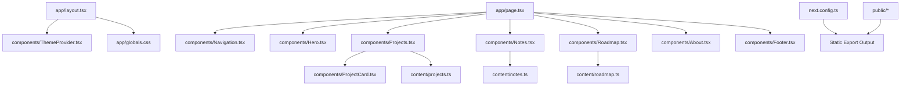
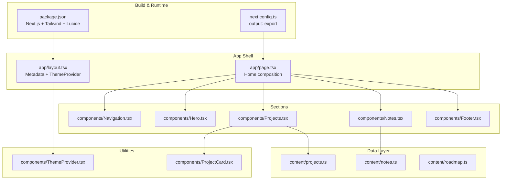
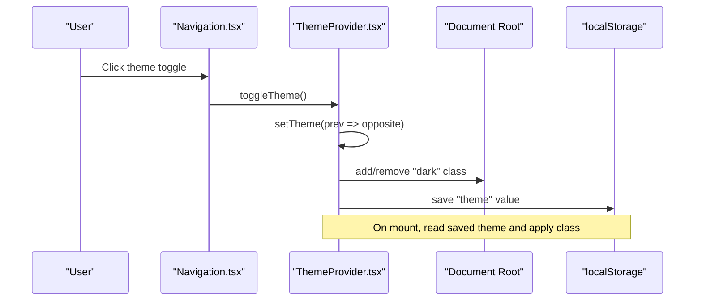
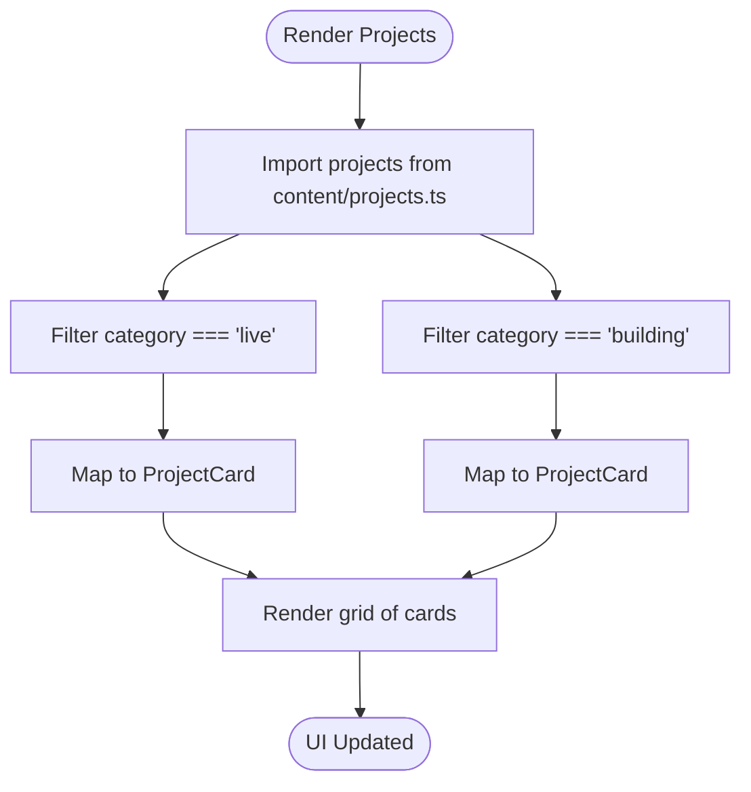
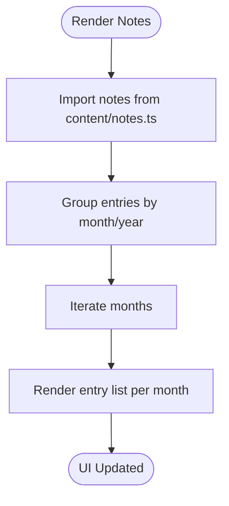
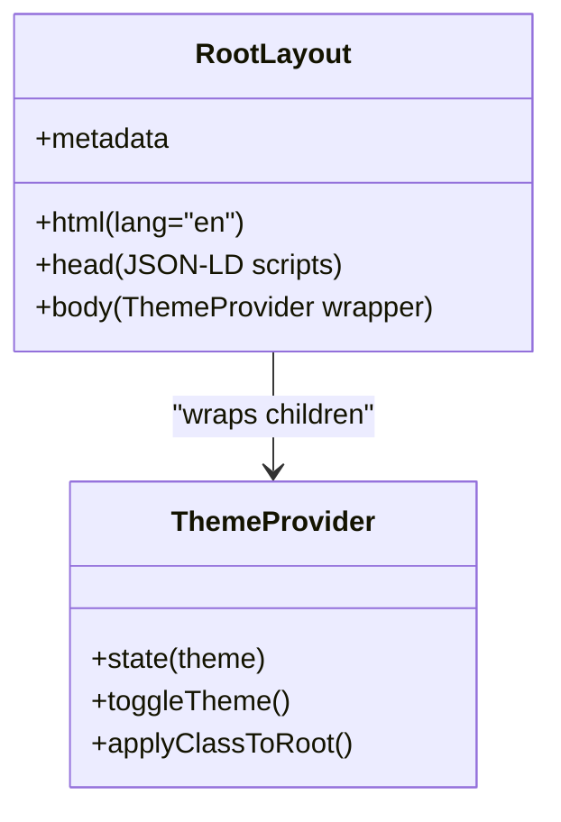
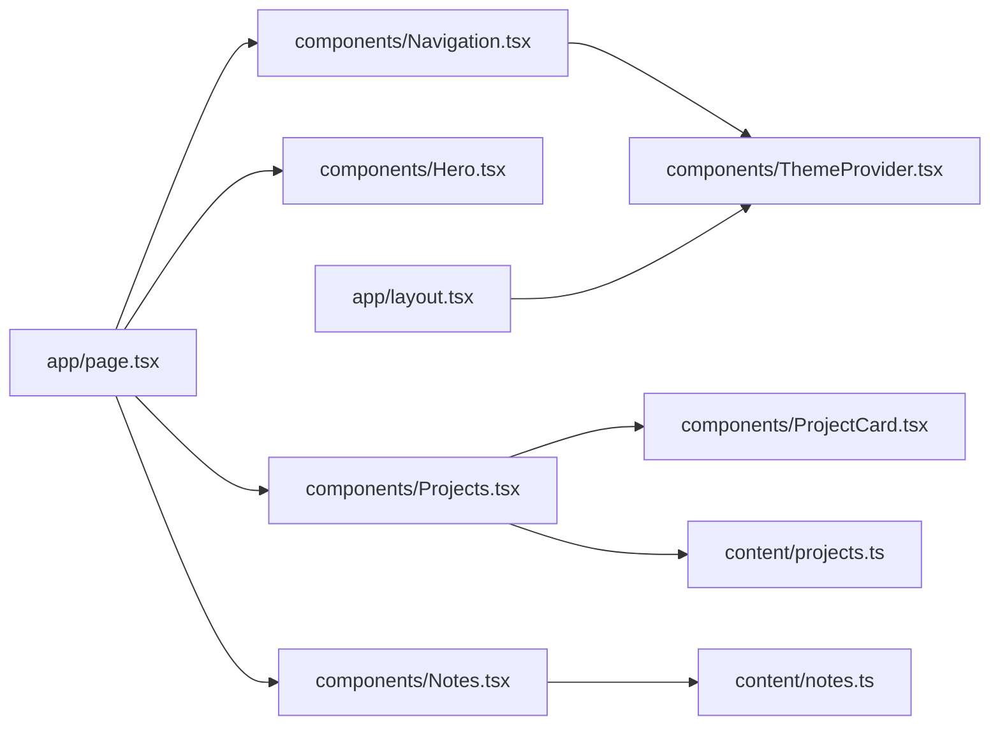

# Architecture Overview

<cite>
**Referenced Files in This Document**
- [README.md](file://README.md)
- [next.config.ts](file://next.config.ts)
- [package.json](file://package.json)
- [app/layout.tsx](file://app/layout.tsx)
- [app/page.tsx](file://app/page.tsx)
- [components/ThemeProvider.tsx](file://components/ThemeProvider.tsx)
- [components/Navigation.tsx](file://components/Navigation.tsx)
- [components/Hero.tsx](file://components/Hero.tsx)
- [components/Projects.tsx](file://components/Projects.tsx)
- [components/Notes.tsx](file://components/Notes.tsx)
- [components/ProjectCard.tsx](file://components/ProjectCard.tsx)
- [content/projects.ts](file://content/projects.ts)
- [content/notes.ts](file://content/notes.ts)
- [content/roadmap.ts](file://content/roadmap.ts)
</cite>

## Table of Contents
1. Introduction
2. Project Structure
3. Core Components
4. Architecture Overview
5. Detailed Component Analysis
6. Dependency Analysis
7. Performance Considerations
8. Troubleshooting Guide
9. Conclusion

## Introduction
This document describes the architecture of the Han Neng portfolio website, a static site built with Next.js App Router and configured for static export. The site follows a component-based architecture that separates presentation components (Hero, Projects, Notes) from utility components (ThemeProvider, ProjectCard). Data flows from TypeScript content files through typed interfaces into React components. Theme switching is implemented using React Context without external dependencies. The system boundaries show how the frontend links to external services such as GitHub and social platforms. Cross-cutting concerns include responsive design patterns, accessibility considerations, and performance optimization strategies. Technology stack decisions and trade-offs are discussed for a static portfolio site.

## Project Structure
The project uses a feature-oriented layout under app/ for routes and components/, with content/ holding static data modules. The root layout configures metadata, fonts, and wraps the application with a theme provider. The home page composes top-level sections. Static assets live under public/. Build configuration enables static export.

**Diagram sources**
- [app/layout.tsx:1-103](file://app/layout.tsx#L1-L103)
- [app/page.tsx:1-26](file://app/page.tsx#L1-L26)
- [components/ThemeProvider.tsx:1-56](file://components/ThemeProvider.tsx#L1-L56)
- [components/Navigation.tsx:1-88](file://components/Navigation.tsx#L1-L88)
- [components/Hero.tsx:1-63](file://components/Hero.tsx#L1-L63)
- [components/Projects.tsx:1-47](file://components/Projects.tsx#L1-L47)
- [components/Notes.tsx:1-39](file://components/Notes.tsx#L1-L39)
- [components/ProjectCard.tsx:1-72](file://components/ProjectCard.tsx#L1-L72)
- [content/projects.ts:1-56](file://content/projects.ts#L1-L56)
- [content/notes.ts:1-19](file://content/notes.ts#L1-L19)
- [content/roadmap.ts:1-33](file://content/roadmap.ts#L1-L33)
- [next.config.ts:1-8](file://next.config.ts#L1-L8)

**Section sources**
- [next.config.ts:1-8](file://next.config.ts#L1-L8)
- [app/layout.tsx:1-103](file://app/layout.tsx#L1-L103)
- [app/page.tsx:1-26](file://app/page.tsx#L1-L26)
- [package.json:1-29](file://package.json#L1-L29)
- [README.md:1-37](file://README.md#L1-L37)

## Core Components
- Root layout: Provides global metadata, Open Graph and Twitter card settings, canonical URL, robots directives, and JSON-LD structured data. It also injects Google Fonts variables and wraps the app with ThemeProvider.
- Home page: Composes Navigation, Hero, Stats, Projects, Notes, Roadmap, About, and Footer.
- ThemeProvider: Implements client-side theme state via React Context, persists preference to localStorage, and toggles a dark class on the document root.
- Navigation: Client component with mobile menu toggle and theme toggle button; consumes useTheme hook.
- Presentation components:
  - Hero: Static hero section with calls to action.
  - Projects: Reads projects data, filters by category, and renders ProjectCard instances.
  - Notes: Renders notes grouped by month/year.
- Utility components:
  - ProjectCard: Displays a single project with status badge, tags, and links to external URLs or GitHub.

Key responsibilities:
- Separation of concerns: Content lives in content/*.ts; UI logic resides in components; layout and metadata in app/*.tsx.
- Type safety: Interfaces in content files define shapes consumed by components.
- Client-only features: Theme management and navigation interactivity are isolated in "use client" components.

**Section sources**
- [app/layout.tsx:16-50](file://app/layout.tsx#L16-L50)
- [app/layout.tsx:52-103](file://app/layout.tsx#L52-L103)
- [app/page.tsx:1-26](file://app/page.tsx#L1-L26)
- [components/ThemeProvider.tsx:1-56](file://components/ThemeProvider.tsx#L1-L56)
- [components/Navigation.tsx:1-88](file://components/Navigation.tsx#L1-L88)
- [components/Hero.tsx:1-63](file://components/Hero.tsx#L1-L63)
- [components/Projects.tsx:1-47](file://components/Projects.tsx#L1-L47)
- [components/Notes.tsx:1-39](file://components/Notes.tsx#L1-L39)
- [components/ProjectCard.tsx:1-72](file://components/ProjectCard.tsx#L1-L72)

## Architecture Overview
High-level design:
- Static Site Generation: next.config.ts sets output to export, producing a fully static site suitable for CDN hosting.
- App Router: app/layout.tsx defines the root layout and metadata; app/page.tsx is the default route composing sections.
- Component Composition: The home page composes modular sections. Each section imports data from content/*.ts and renders presentational components.
- State Management: Theme state is managed locally within ThemeProvider using React Context and persisted to localStorage. No external state libraries are used.
- External Links: The site links out to GitHub and other services via href attributes; no server-side API calls are made.

**Diagram sources**
- [next.config.ts:1-8](file://next.config.ts#L1-L8)
- [package.json:1-29](file://package.json#L1-L29)
- [app/layout.tsx:1-103](file://app/layout.tsx#L1-L103)
- [app/page.tsx:1-26](file://app/page.tsx#L1-L26)
- [components/ThemeProvider.tsx:1-56](file://components/ThemeProvider.tsx#L1-L56)
- [components/Navigation.tsx:1-88](file://components/Navigation.tsx#L1-L88)
- [components/Hero.tsx:1-63](file://components/Hero.tsx#L1-L63)
- [components/Projects.tsx:1-47](file://components/Projects.tsx#L1-L47)
- [components/Notes.tsx:1-39](file://components/Notes.tsx#L1-L39)
- [components/ProjectCard.tsx:1-72](file://components/ProjectCard.tsx#L1-L72)
- [content/projects.ts:1-56](file://content/projects.ts#L1-L56)
- [content/notes.ts:1-19](file://content/notes.ts#L1-L19)
- [content/roadmap.ts:1-33](file://content/roadmap.ts#L1-L33)

## Detailed Component Analysis

### ThemeProvider and Theme Switching Flow
The theme system is implemented with React Context and local storage persistence. The provider initializes theme state, reads any saved preference, applies the dark class to the document root, and exposes a toggle function. Navigation consumes this context to render the appropriate icon and trigger toggling.

**Diagram sources**
- [components/Navigation.tsx:15-88](file://components/Navigation.tsx#L15-L88)
- [components/ThemeProvider.tsx:15-56](file://components/ThemeProvider.tsx#L15-L56)

**Section sources**
- [components/ThemeProvider.tsx:1-56](file://components/ThemeProvider.tsx#L1-L56)
- [components/Navigation.tsx:1-88](file://components/Navigation.tsx#L1-L88)

### Projects Data Flow and Rendering
Projects data is defined in a TypeScript module with an interface describing each project. The Projects component filters items by category and maps them to ProjectCard components. ProjectCard renders status badges, tags, and external links.

**Diagram sources**
- [components/Projects.tsx:1-47](file://components/Projects.tsx#L1-L47)
- [content/projects.ts:1-56](file://content/projects.ts#L1-L56)
- [components/ProjectCard.tsx:1-72](file://components/ProjectCard.tsx#L1-L72)

**Section sources**
- [components/Projects.tsx:1-47](file://components/Projects.tsx#L1-L47)
- [content/projects.ts:1-56](file://content/projects.ts#L1-L56)
- [components/ProjectCard.tsx:1-72](file://components/ProjectCard.tsx#L1-L72)

### Notes Section Rendering
Notes are grouped by month/year and rendered as a timeline-like list. The component imports notes from content/notes.ts and iterates entries to display updates.

**Diagram sources**
- [components/Notes.tsx:1-39](file://components/Notes.tsx#L1-L39)
- [content/notes.ts:1-19](file://content/notes.ts#L1-L19)

**Section sources**
- [components/Notes.tsx:1-39](file://components/Notes.tsx#L1-L39)
- [content/notes.ts:1-19](file://content/notes.ts#L1-L19)

### Root Layout and Metadata
The root layout configures SEO metadata, Open Graph and Twitter card fields, canonical URL, robots directives, and injects JSON-LD structured data. It also sets up font variables and wraps children with ThemeProvider.

**Diagram sources**
- [app/layout.tsx:16-50](file://app/layout.tsx#L16-L50)
- [app/layout.tsx:52-103](file://app/layout.tsx#L52-L103)
- [components/ThemeProvider.tsx:1-56](file://components/ThemeProvider.tsx#L1-L56)

**Section sources**
- [app/layout.tsx:16-50](file://app/layout.tsx#L16-L50)
- [app/layout.tsx:52-103](file://app/layout.tsx#L52-L103)

## Dependency Analysis
Component relationships and data flow:
- app/page.tsx composes multiple sections.
- Sections import data from content/*.ts and may depend on utility components like ProjectCard.
- ThemeProvider provides theme state to Navigation and potentially other components.
- Static export configuration decouples runtime from serverless functions.

**Diagram sources**
- [app/page.tsx:1-26](file://app/page.tsx#L1-L26)
- [components/Navigation.tsx:1-88](file://components/Navigation.tsx#L1-L88)
- [components/Hero.tsx:1-63](file://components/Hero.tsx#L1-L63)
- [components/Projects.tsx:1-47](file://components/Projects.tsx#L1-L47)
- [components/Notes.tsx:1-39](file://components/Notes.tsx#L1-L39)
- [components/ProjectCard.tsx:1-72](file://components/ProjectCard.tsx#L1-L72)
- [content/projects.ts:1-56](file://content/projects.ts#L1-L56)
- [content/notes.ts:1-19](file://content/notes.ts#L1-L19)
- [app/layout.tsx:1-103](file://app/layout.tsx#L1-L103)
- [components/ThemeProvider.tsx:1-56](file://components/ThemeProvider.tsx#L1-L56)

**Section sources**
- [app/page.tsx:1-26](file://app/page.tsx#L1-L26)
- [components/Projects.tsx:1-47](file://components/Projects.tsx#L1-L47)
- [components/Notes.tsx:1-39](file://components/Notes.tsx#L1-L39)
- [components/Navigation.tsx:1-88](file://components/Navigation.tsx#L1-L88)
- [components/ThemeProvider.tsx:1-56](file://components/ThemeProvider.tsx#L1-L56)

## Performance Considerations
- Static export: The build produces static HTML/CSS/JS, enabling fast CDN delivery and zero server latency.
- Minimal dependencies: Only React, ReactDOM, Next.js, Tailwind CSS, and Lucide icons are used, reducing bundle size.
- Client-only boundaries: Only components requiring interactivity (Navigation, ThemeProvider) are marked "use client", keeping most pages static.
- Font loading: Google Fonts are loaded via next/font with variable injection, improving CLS and load performance.
- Image strategy: No heavy images are embedded; icons are vector SVGs from lucide-react, which tree-shake well.
- Accessibility: Semantic HTML, aria-labels on interactive controls, and keyboard-friendly navigation reduce reflows and improve usability.
- SEO: Metadata and structured data are provided at build time for better indexing and rich previews.

[No sources needed since this section provides general guidance]

## Troubleshooting Guide
Common issues and resolutions:
- Hydration mismatch due to theme: Ensure ThemeProvider runs only on the client and defers rendering until mounted to avoid mismatches between server and client.
- Missing aria labels: Verify all interactive elements (menu toggle, theme toggle) have descriptive aria-labels for screen readers.
- Broken external links: Validate href values for GitHub and project URLs; ensure target="_blank" and rel="noopener noreferrer" are applied for security.
- Static export limitations: Avoid runtime APIs that require a server; keep dynamic behavior in "use client" components and rely on static data from content/*.ts.
- Tailwind classes not applying: Confirm Tailwind is configured and CSS variables are correctly referenced in components.

**Section sources**
- [components/ThemeProvider.tsx:1-56](file://components/ThemeProvider.tsx#L1-L56)
- [components/Navigation.tsx:1-88](file://components/Navigation.tsx#L1-L88)
- [components/ProjectCard.tsx:1-72](file://components/ProjectCard.tsx#L1-L72)
- [app/layout.tsx:16-50](file://app/layout.tsx#L16-L50)

## Conclusion
The Han Neng portfolio website leverages Next.js App Router with static export to deliver a fast, accessible, and maintainable site. The component-based architecture cleanly separates presentation from utilities, while TypeScript interfaces enforce data contracts across content and UI layers. Theme switching is implemented with React Context and localStorage, avoiding external dependencies. System boundaries remain simple: the frontend links to external services rather than calling APIs, aligning with the static nature of the site. Responsive design, accessibility, and performance optimizations are integrated throughout, making the site suitable for deployment on CDNs like Cloudflare Pages.

[No sources needed since this section summarizes without analyzing specific files]