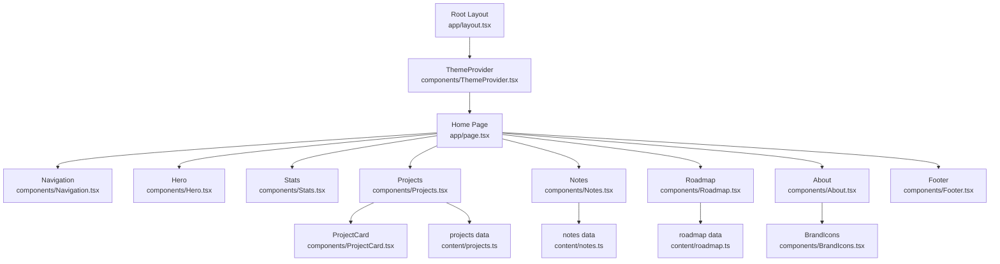
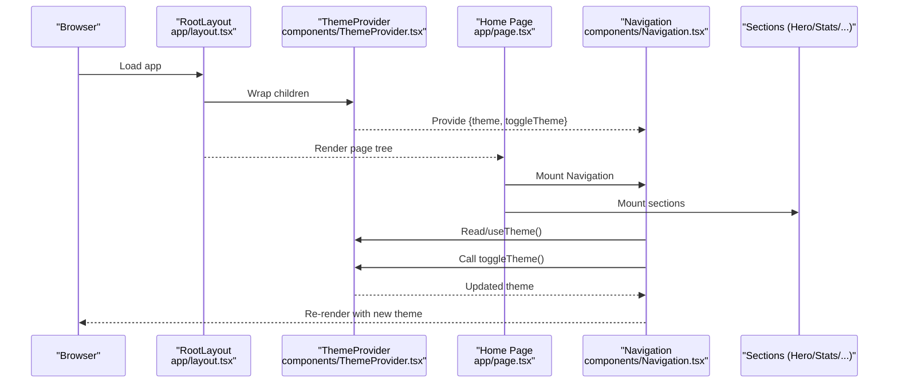
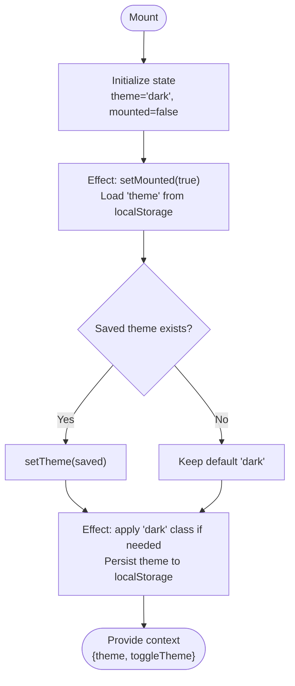
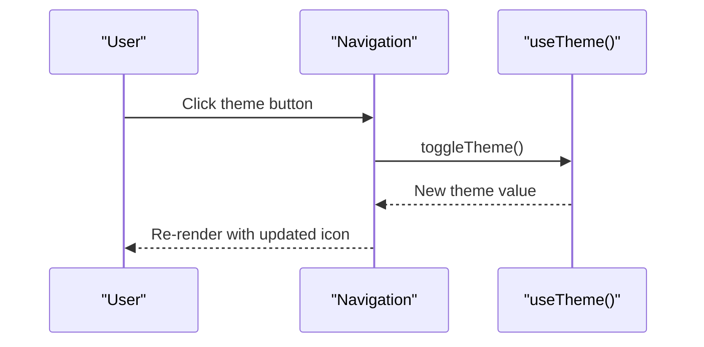
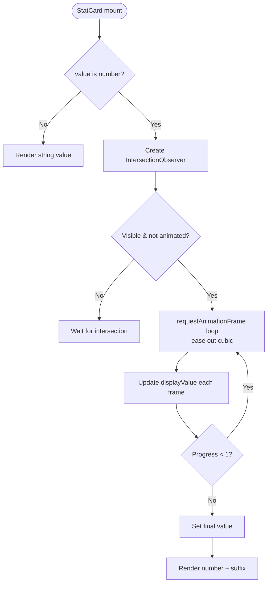
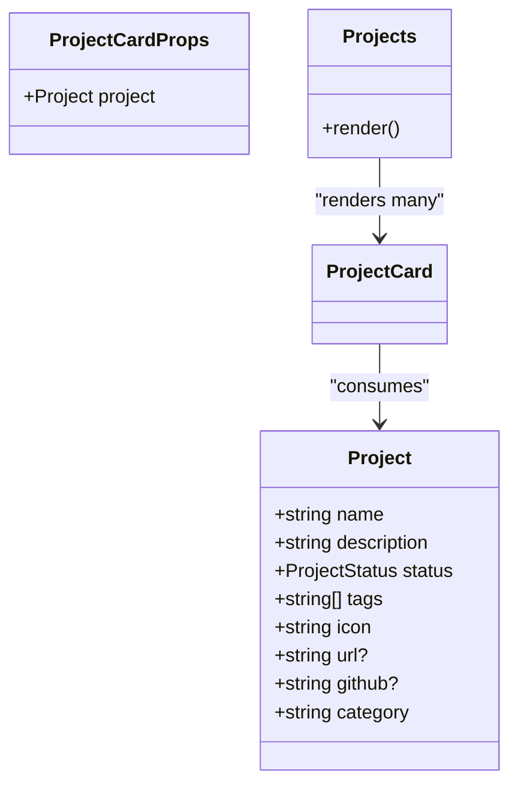
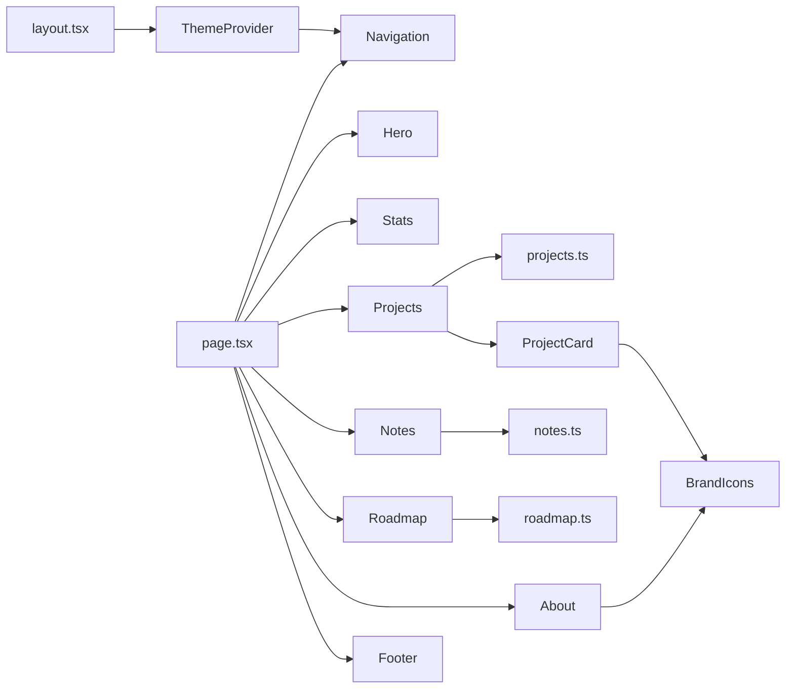

# Components Reference

<cite>
**Referenced Files in This Document**
- [layout.tsx](file://app/layout.tsx)
- [page.tsx](file://app/page.tsx)
- [globals.css](file://app/globals.css)
- [ThemeProvider.tsx](file://components/ThemeProvider.tsx)
- [Navigation.tsx](file://components/Navigation.tsx)
- [Hero.tsx](file://components/Hero.tsx)
- [Stats.tsx](file://components/Stats.tsx)
- [Projects.tsx](file://components/Projects.tsx)
- [ProjectCard.tsx](file://components/ProjectCard.tsx)
- [Notes.tsx](file://components/Notes.tsx)
- [Roadmap.tsx](file://components/Roadmap.tsx)
- [About.tsx](file://components/About.tsx)
- [Footer.tsx](file://components/Footer.tsx)
- [BrandIcons.tsx](file://components/BrandIcons.tsx)
- [projects.ts](file://content/projects.ts)
- [notes.ts](file://content/notes.ts)
- [roadmap.ts](file://content/roadmap.ts)
</cite>

## Table of Contents
1. Introduction
2. Project Structure
3. Core Components
4. Architecture Overview
5. Detailed Component Analysis
6. Dependency Analysis
7. Performance Considerations
8. Troubleshooting Guide
9. Conclusion

## Introduction
This document provides a comprehensive reference for all UI components in the Han Neng portfolio website. It explains component props, events, customization options, composition patterns, and styling approaches using Tailwind CSS with CSS variables for theming. The documentation starts from ThemeProvider wrapping the entire application, through layout components like Navigation and Footer, to section components such as Hero, Projects, Notes, Roadmap, About, and Stats. Utility components like ProjectCard and BrandIcons are documented with their reusable patterns and type definitions.

## Project Structure
The application is a Next.js app with a single-page layout composed of modular React components under components/. Data is centralized in content/ modules. The root layout wraps the app with ThemeProvider and defines metadata and global styles. The page composes the visible sections in order.

**Diagram sources**
- [layout.tsx:52-103](file://app/layout.tsx#L52-L103)
- [page.tsx:1-26](file://app/page.tsx#L1-L26)
- [ThemeProvider.tsx:15-51](file://components/ThemeProvider.tsx#L15-L51)
- [Navigation.tsx:15-87](file://components/Navigation.tsx#L15-L87)
- [Hero.tsx:3-62](file://components/Hero.tsx#L3-L62)
- [Stats.tsx:71-84](file://components/Stats.tsx#L71-L84)
- [Projects.tsx:4-46](file://components/Projects.tsx#L4-L46)
- [ProjectCard.tsx:15-71](file://components/ProjectCard.tsx#L15-L71)
- [Notes.tsx:3-38](file://components/Notes.tsx#L3-L38)
- [Roadmap.tsx:3-80](file://components/Roadmap.tsx#L3-L80)
- [About.tsx:4-63](file://components/About.tsx#L4-L63)
- [Footer.tsx:1-20](file://components/Footer.tsx#L1-L20)
- [BrandIcons.tsx:1-27](file://components/BrandIcons.tsx#L1-L27)
- [projects.ts:14-55](file://content/projects.ts#L14-L55)
- [notes.ts:7-18](file://content/notes.ts#L7-L18)
- [roadmap.ts:6-32](file://content/roadmap.ts#L6-L32)

**Section sources**
- [layout.tsx:52-103](file://app/layout.tsx#L52-L103)
- [page.tsx:1-26](file://app/page.tsx#L1-L26)

## Core Components
This section summarizes each component’s purpose, props, events, and key behaviors.

- ThemeProvider
  - Purpose: Provides theme state (dark/light), persists selection, toggles a class on the document root, and exposes a hook for consumers.
  - Props: children (ReactNode).
  - Events: toggleTheme function exposed via context; no DOM events directly on this component.
  - Behavior: Initializes theme from localStorage, applies "dark" class to documentElement, prevents hydration mismatch by deferring render until mounted.
  - Hook: useTheme returns { theme, toggleTheme }.

- Navigation
  - Purpose: Fixed top navigation bar with links to sections and a theme toggle button. Responsive mobile menu.
  - Props: none.
  - Events: onClick handlers for theme toggle and mobile menu open/close.
  - Behavior: Uses useTheme to read and toggle theme; renders desktop links and a mobile drawer.

- Hero
  - Purpose: Landing hero section with title, tagline, description, and call-to-action buttons.
  - Props: none.
  - Events: none.
  - Behavior: Uses anchor links to navigate within the page.

- Stats
  - Purpose: Displays animated counters for product metrics.
  - Props: none at the section level; internal StatCard accepts label, value, suffix.
  - Events: none.
  - Behavior: IntersectionObserver triggers count-up animation only once per card when visible.

- Projects
  - Purpose: Lists live and building projects, rendering ProjectCard for each.
  - Props: none.
  - Events: none.
  - Behavior: Filters project data by category and renders two grids.

- ProjectCard
  - Purpose: Reusable card displaying a project’s icon, status badge, name, description, tags, and action links.
  - Props: project (typed as Project).
  - Events: none.
  - Behavior: Renders optional external link and GitHub link based on presence of url/github fields.

- Notes
  - Purpose: Timeline-like list of recent updates grouped by month/year.
  - Props: none.
  - Events: none.
  - Behavior: Iterates notes array and renders entries with bullet markers.

- Roadmap
  - Purpose: Three-column roadmap showing Now, Next, Future items.
  - Props: none.
  - Events: none.
  - Behavior: Reads roadmap object and renders lists per column.

- About
  - Purpose: Personal introduction with social links.
  - Props: none.
  - Events: none.
  - Behavior: Renders static text and links to LinkedIn, GitHub, and an external site.

- Footer
  - Purpose: Site footer with copyright and branding text.
  - Props: none.
  - Events: none.
  - Behavior: Static content.

- BrandIcons
  - Purpose: Lightweight SVG icons for GitHub and LinkedIn.
  - Props: size (number, default 16).
  - Events: none.
  - Behavior: Renders inline SVGs with currentColor fill.

**Section sources**
- [ThemeProvider.tsx:15-55](file://components/ThemeProvider.tsx#L15-L55)
- [Navigation.tsx:15-87](file://components/Navigation.tsx#L15-L87)
- [Hero.tsx:3-62](file://components/Hero.tsx#L3-L62)
- [Stats.tsx:5-69](file://components/Stats.tsx#L5-L69)
- [Projects.tsx:4-46](file://components/Projects.tsx#L4-L46)
- [ProjectCard.tsx:5-71](file://components/ProjectCard.tsx#L5-L71)
- [Notes.tsx:3-38](file://components/Notes.tsx#L3-L38)
- [Roadmap.tsx:3-80](file://components/Roadmap.tsx#L3-L80)
- [About.tsx:4-63](file://components/About.tsx#L4-L63)
- [Footer.tsx:1-20](file://components/Footer.tsx#L1-L20)
- [BrandIcons.tsx:1-27](file://components/BrandIcons.tsx#L1-L27)

## Architecture Overview
The application uses a clear hierarchy:
- Root layout sets up fonts, metadata, and wraps everything in ThemeProvider.
- Home page composes the main sections in a fixed order.
- Each section component is self-contained and reads data from content modules.
- ThemeProvider centralizes theme state and exposes it via context.

**Diagram sources**
- [layout.tsx:52-103](file://app/layout.tsx#L52-L103)
- [ThemeProvider.tsx:15-55](file://components/ThemeProvider.tsx#L15-L55)
- [page.tsx:1-26](file://app/page.tsx#L1-L26)
- [Navigation.tsx:15-87](file://components/Navigation.tsx#L15-L87)

## Detailed Component Analysis

### ThemeProvider
- Role: Global theme provider and hook source.
- State: theme ("dark" | "light"), mounted flag.
- Effects:
  - On mount: load saved theme from localStorage and set mounted true.
  - On theme change: add/remove "dark" class on document.documentElement and persist to localStorage.
- Context API:
  - ThemeContext.Provider exposes { theme, toggleTheme }.
  - useTheme hook returns context values.
- Hydration safety: Returns children without provider until mounted to avoid mismatch.

**Diagram sources**
- [ThemeProvider.tsx:15-55](file://components/ThemeProvider.tsx#L15-L55)

**Section sources**
- [ThemeProvider.tsx:15-55](file://components/ThemeProvider.tsx#L15-L55)

### Navigation
- Role: Top navigation with responsive behavior and theme toggle.
- State: isOpen (boolean) for mobile menu.
- Interactions:
  - Clicking theme button calls toggleTheme from useTheme.
  - Mobile menu toggled by clicking menu button; closing on link click.
- Styling: Fixed position, backdrop blur, border, and color tokens via CSS variables.

**Diagram sources**
- [Navigation.tsx:15-87](file://components/Navigation.tsx#L15-L87)
- [ThemeProvider.tsx:53-55](file://components/ThemeProvider.tsx#L53-L55)

**Section sources**
- [Navigation.tsx:15-87](file://components/Navigation.tsx#L15-L87)

### Hero
- Role: Hero section with title, tagline, description, and CTAs.
- Composition: Pure presentational component; no props or events.
- Accessibility: Anchor links to sections; semantic headings.

**Section sources**
- [Hero.tsx:3-62](file://components/Hero.tsx#L3-L62)

### Stats
- Role: Animated counters for key metrics.
- Internal StatCard props:
  - label: string
  - value: number | string
  - suffix?: string
- Animation logic:
  - IntersectionObserver triggers once per card.
  - requestAnimationFrame loop with cubic ease-out over ~1 second.
  - String values bypass numeric animation.

**Diagram sources**
- [Stats.tsx:5-69](file://components/Stats.tsx#L5-L69)

**Section sources**
- [Stats.tsx:5-69](file://components/Stats.tsx#L5-L69)

### Projects and ProjectCard
- Projects
  - Filters data into live and building categories.
  - Renders two grids of ProjectCard instances.
- ProjectCard
  - Props: project (type Project).
  - Status colors mapped via a local record keyed by status strings.
  - Renders optional Visit Project and GitHub actions.

**Diagram sources**
- [projects.ts:1-12](file://content/projects.ts#L1-L12)
- [ProjectCard.tsx:5-71](file://components/ProjectCard.tsx#L5-L71)
- [Projects.tsx:4-46](file://components/Projects.tsx#L4-L46)

**Section sources**
- [Projects.tsx:4-46](file://components/Projects.tsx#L4-L46)
- [ProjectCard.tsx:5-71](file://components/ProjectCard.tsx#L5-L71)
- [projects.ts:1-12](file://content/projects.ts#L1-L12)

### Notes
- Role: Timeline-style updates grouped by month/year.
- Data shape: Note[] with month, year, entries[].
- Rendering: For each note, renders a heading and a list with styled bullets.

**Section sources**
- [Notes.tsx:3-38](file://components/Notes.tsx#L3-L38)
- [notes.ts:1-5](file://content/notes.ts#L1-L5)

### Roadmap
- Role: Three-column plan view (Now, Next, Future).
- Data shape: roadmap object with now/next/future, each having title and items[].
- Rendering: Maps items to list entries with distinct dot colors.

**Section sources**
- [Roadmap.tsx:3-80](file://components/Roadmap.tsx#L3-L80)
- [roadmap.ts:1-4](file://content/roadmap.ts#L1-L4)

### About
- Role: Personal bio and social links.
- Composition: Uses BrandIcons for LinkedIn and GitHub.

**Section sources**
- [About.tsx:4-63](file://components/About.tsx#L4-L63)
- [BrandIcons.tsx:15-27](file://components/BrandIcons.tsx#L15-L27)

### Footer
- Role: Static footer with copyright and tagline.

**Section sources**
- [Footer.tsx:1-20](file://components/Footer.tsx#L1-L20)

### BrandIcons
- Role: Inline SVG icons with configurable size.
- Props: size (number, default 16).
- Usage: Consumed by ProjectCard and About.

**Section sources**
- [BrandIcons.tsx:1-27](file://components/BrandIcons.tsx#L1-L27)

## Dependency Analysis
- ThemeProvider is consumed by Navigation via useTheme.
- Projects consumes content/projects.ts and renders ProjectCard.
- Notes consumes content/notes.ts.
- Roadmap consumes content/roadmap.ts.
- About and ProjectCard consume BrandIcons.
- Root layout imports ThemeProvider and wraps the page.
- Page composes all visible sections.

**Diagram sources**
- [layout.tsx:52-103](file://app/layout.tsx#L52-L103)
- [page.tsx:1-26](file://app/page.tsx#L1-L26)
- [ThemeProvider.tsx:53-55](file://components/ThemeProvider.tsx#L53-L55)
- [Navigation.tsx:15-87](file://components/Navigation.tsx#L15-L87)
- [Projects.tsx:4-46](file://components/Projects.tsx#L4-L46)
- [ProjectCard.tsx:5-71](file://components/ProjectCard.tsx#L5-L71)
- [Notes.tsx:3-38](file://components/Notes.tsx#L3-L38)
- [Roadmap.tsx:3-80](file://components/Roadmap.tsx#L3-L80)
- [About.tsx:4-63](file://components/About.tsx#L4-L63)
- [Footer.tsx:1-20](file://components/Footer.tsx#L1-L20)
- [BrandIcons.tsx:1-27](file://components/BrandIcons.tsx#L1-L27)
- [projects.ts:14-55](file://content/projects.ts#L14-L55)
- [notes.ts:7-18](file://content/notes.ts#L7-L18)
- [roadmap.ts:6-32](file://content/roadmap.ts#L6-L32)

**Section sources**
- [page.tsx:1-26](file://app/page.tsx#L1-L26)
- [layout.tsx:52-103](file://app/layout.tsx#L52-L103)

## Performance Considerations
- ThemeProvider avoids hydration issues by deferring provider until after mount.
- Stats uses IntersectionObserver to trigger animations only when visible and ensures they run once per card.
- Navigation and other components are lightweight and rely on Tailwind utility classes for efficient rendering.
- Avoid heavy computations inside frequently re-rendered components; keep data transformations in parent components where possible.

[No sources needed since this section provides general guidance]

## Troubleshooting Guide
- Theme flicker on first load
  - Symptom: Brief flash of incorrect theme before dark mode applies.
  - Cause: Client-side initialization of theme after mount.
  - Mitigation: Ensure the root html element has the correct initial class and that ThemeProvider waits for mounted state before providing context.
- Counters not animating
  - Symptom: Stats numbers do not animate.
  - Causes: Not visible in viewport, already animated, or value is a string.
  - Checks: Verify IntersectionObserver threshold and ensure numeric values are passed.
- Links not opening correctly
  - Symptom: External links lack proper security attributes.
  - Fix: Use target="_blank" with rel="noopener noreferrer" for external URLs.
- Missing icons
  - Symptom: Brand icons not rendering.
  - Cause: Incorrect prop usage or missing size prop defaults.
  - Fix: Ensure size prop is provided or relies on default; verify SVG paths are intact.

**Section sources**
- [ThemeProvider.tsx:15-55](file://components/ThemeProvider.tsx#L15-L55)
- [Stats.tsx:5-69](file://components/Stats.tsx#L5-L69)
- [ProjectCard.tsx:45-67](file://components/ProjectCard.tsx#L45-L67)
- [BrandIcons.tsx:1-27](file://components/BrandIcons.tsx#L1-L27)

## Conclusion
The Han Neng portfolio website follows a clean, modular architecture centered around ThemeProvider for theming and a flat composition of section components in the home page. Components are small, focused, and typed with TypeScript interfaces defined in content modules. Styling leverages Tailwind CSS utilities and CSS variables for consistent theming across light and dark modes. Extending or modifying components should preserve these patterns: keep props minimal and typed, prefer composition over complexity, and use shared data modules for content.