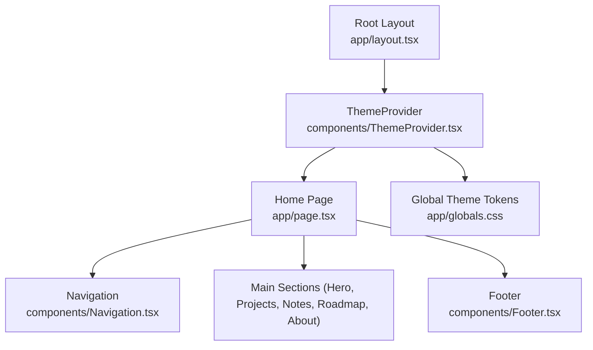
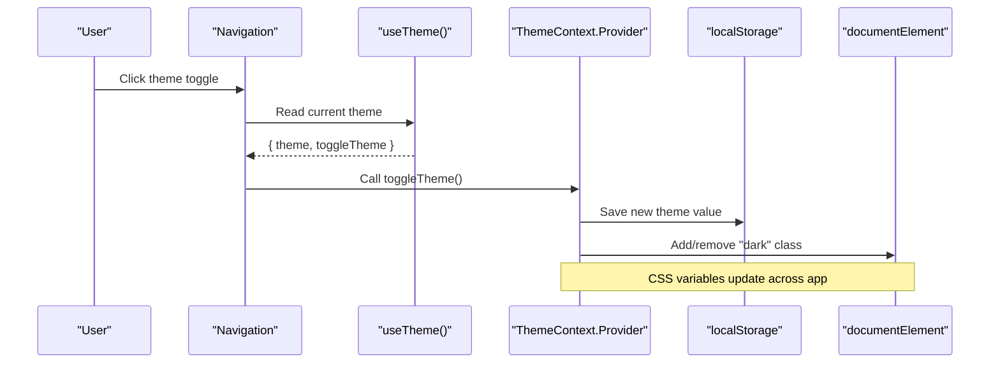
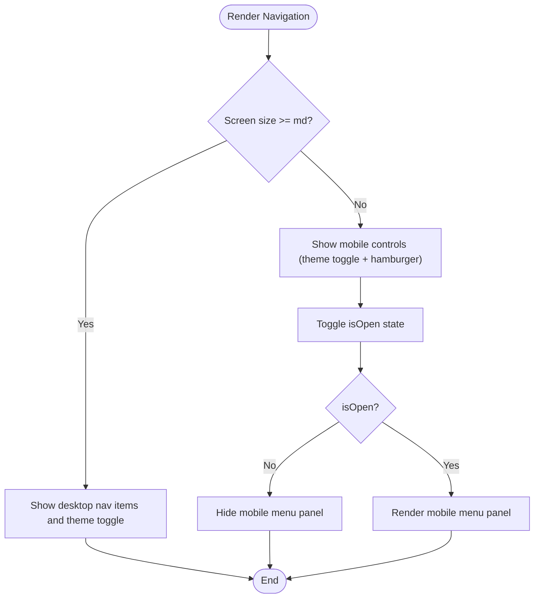
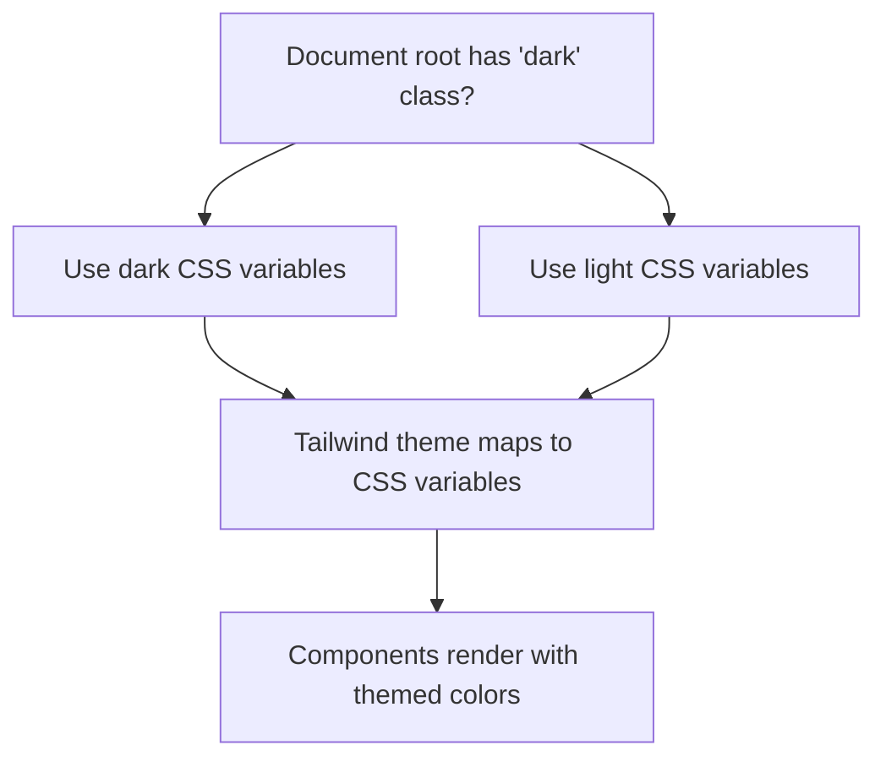
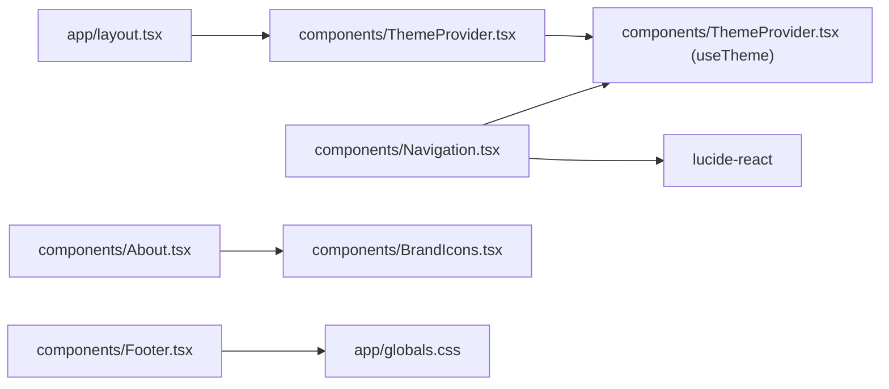

# Core Components

<cite>
**Referenced Files in This Document**
- [ThemeProvider.tsx](file://components/ThemeProvider.tsx)
- [Navigation.tsx](file://components/Navigation.tsx)
- [Footer.tsx](file://components/Footer.tsx)
- [BrandIcons.tsx](file://components/BrandIcons.tsx)
- [layout.tsx](file://app/layout.tsx)
- [page.tsx](file://app/page.tsx)
- [globals.css](file://app/globals.css)
</cite>

## Table of Contents
1. [Introduction](#introduction)
2. [Project Structure](#project-structure)
3. [Core Components](#core-components)
4. [Architecture Overview](#architecture-overview)
5. [Detailed Component Analysis](#detailed-component-analysis)
6. [Dependency Analysis](#dependency-analysis)
7. [Performance Considerations](#performance-considerations)
8. [Troubleshooting Guide](#troubleshooting-guide)
9. [Conclusion](#conclusion)

## Introduction
This document explains the core layout and infrastructure components that power the Han Neng portfolio website. It focuses on:
- ThemeProvider: React Context-based theme state management, localStorage persistence, and the useTheme custom hook.
- Navigation: Responsive navigation with a mobile hamburger menu and integrated theme toggle.
- Footer: Branding elements and social media links.
- How these components wrap and provide global functionality to all other components in the application.

The goal is to make it easy for both technical and non-technical readers to understand how theming and layout are implemented and extended.

## Project Structure
At a high level:
- The root layout wraps the entire app with ThemeProvider so every component can access theme state.
- The home page composes Navigation, main content sections, and Footer.
- Global CSS defines light/dark color tokens and Tailwind theme mappings.



**Diagram sources**
- [layout.tsx:52-102](file://app/layout.tsx#L52-L102)
- [page.tsx:10-25](file://app/page.tsx#L10-L25)
- [ThemeProvider.tsx:15-51](file://components/ThemeProvider.tsx#L15-L51)
- [Navigation.tsx:15-87](file://components/Navigation.tsx#L15-L87)
- [Footer.tsx:1-20](file://components/Footer.tsx#L1-L20)
- [globals.css:5-27](file://app/globals.css#L5-L27)

**Section sources**
- [layout.tsx:52-102](file://app/layout.tsx#L52-L102)
- [page.tsx:10-25](file://app/page.tsx#L10-L25)

## Core Components
- ThemeProvider: Provides theme state and a toggle function via React Context; persists selection to localStorage; applies a "dark" class to the document root to switch CSS variables.
- useTheme: Custom hook to consume theme context from any descendant component.
- Navigation: Fixed top bar with desktop links and a mobile hamburger menu; includes a theme toggle button using useTheme.
- Footer: Simple branding footer with copyright and tagline.
- BrandIcons: Reusable SVG icons for GitHub and LinkedIn used by other components.

Key responsibilities:
- Global theming via ThemeProvider and CSS variables.
- Responsive navigation behavior and accessibility attributes.
- Consistent branding and social link presentation.

**Section sources**
- [ThemeProvider.tsx:1-56](file://components/ThemeProvider.tsx#L1-L56)
- [Navigation.tsx:1-88](file://components/Navigation.tsx#L1-L88)
- [Footer.tsx:1-21](file://components/Footer.tsx#L1-L21)
- [BrandIcons.tsx:1-28](file://components/BrandIcons.tsx#L1-L28)
- [globals.css:5-27](file://app/globals.css#L5-L27)

## Architecture Overview
The application uses a provider pattern at the root to distribute theme state globally. Components like Navigation consume this state to render appropriate UI and trigger updates.



**Diagram sources**
- [Navigation.tsx:15-87](file://components/Navigation.tsx#L15-L87)
- [ThemeProvider.tsx:15-51](file://components/ThemeProvider.tsx#L15-L51)
- [globals.css:5-27](file://app/globals.css#L5-L27)

## Detailed Component Analysis

### ThemeProvider and useTheme
- Purpose: Centralize theme state and expose it through Context.
- State:
  - theme: "dark" | "light"
  - mounted: boolean to avoid hydration mismatch
- Persistence:
  - On mount, reads localStorage key "theme" and sets initial theme if present.
  - On theme change, writes to localStorage and toggles the "dark" class on the document root.
- Rendering:
  - While not mounted, renders children without providing context to prevent flash.
  - After mount, provides { theme, toggleTheme } via ThemeContext.Provider.
- Custom Hook:
  - useTheme returns the context value for any descendant component.

```mermaid
classDiagram
class ThemeProvider {
+children : ReactNode
+state : { theme : "dark"|"light", mounted : boolean }
+toggleTheme() : void
}
class ThemeContext {
+value : { theme : "dark"|"light", toggleTheme() : void }
}
class useTheme {
+returns : { theme : "dark"|"light", toggleTheme() : void }
}
ThemeProvider --> ThemeContext : "provides"
useTheme --> ThemeContext : "consumes"
```

**Diagram sources**
- [ThemeProvider.tsx:7-13](file://components/ThemeProvider.tsx#L7-L13)
- [ThemeProvider.tsx:15-51](file://components/ThemeProvider.tsx#L15-L51)
- [ThemeProvider.tsx:53-55](file://components/ThemeProvider.tsx#L53-L55)

TypeScript definitions and props:
- Theme type: "dark" | "light"
- Context shape: { theme: Theme; toggleTheme(): void }
- ThemeProvider props: { children: React.ReactNode }
- useTheme return type: same as context shape

Usage examples:
- Root layout wraps the app with ThemeProvider.
- Navigation consumes useTheme to read current theme and call toggleTheme.

**Section sources**
- [ThemeProvider.tsx:1-56](file://components/ThemeProvider.tsx#L1-L56)
- [layout.tsx:52-102](file://app/layout.tsx#L52-L102)
- [Navigation.tsx:15-87](file://components/Navigation.tsx#L15-L87)

### Navigation
- Responsibilities:
  - Render fixed top navigation bar.
  - Provide desktop links and a mobile hamburger menu.
  - Integrate theme toggle using useTheme.
- Responsive design:
  - Desktop: horizontal list of links and a theme toggle button.
  - Mobile: compact header with theme toggle and hamburger icon; collapsible menu panel.
- Accessibility:
  - aria-label attributes on interactive buttons.
- Behavior:
  - Toggles open/close state for mobile menu.
  - Closes mobile menu when a link is clicked.
  - Uses lucide-react icons for menu states and theme indicators.



**Diagram sources**
- [Navigation.tsx:15-87](file://components/Navigation.tsx#L15-L87)

Props and interfaces:
- No external props; Navigation is self-contained.

Integration with theme context:
- Reads current theme and calls toggleTheme to switch between dark and light modes.

**Section sources**
- [Navigation.tsx:1-88](file://components/Navigation.tsx#L1-L88)

### Footer
- Responsibilities:
  - Display brand name, tagline, and technology credits.
- Structure:
  - Centered container with consistent spacing and typography.
  - Uses semantic footer element.
- Social media links:
  - Not directly included in Footer; social links are provided in the About section using BrandIcons.

Prop interfaces:
- No props required.

Branding elements:
- Copyright line with year and brand name.
- Tagline and mission statement.
- Technology stack mention.

**Section sources**
- [Footer.tsx:1-21](file://components/Footer.tsx#L1-L21)

### BrandIcons
- Purpose: Provide lightweight, reusable SVG icons for social platforms.
- Exports:
  - GithubIcon: Accepts optional size prop.
  - LinkedInIcon: Accepts optional size prop.
- Usage:
  - Used by About section to create accessible social links.

Prop interfaces:
- size?: number (default 16)

**Section sources**
- [BrandIcons.tsx:1-28](file://components/BrandIcons.tsx#L1-L28)

### Global Theming and CSS Variables
- Light and dark palettes are defined as CSS custom properties under :root and .dark.
- Tailwind theme mapping exposes these variables as Tailwind colors and fonts.
- Body and global transitions ensure smooth theme switching.



**Diagram sources**
- [globals.css:5-27](file://app/globals.css#L5-L27)
- [globals.css:29-40](file://app/globals.css#L29-L40)
- [globals.css:42-51](file://app/globals.css#L42-L51)

**Section sources**
- [globals.css:5-27](file://app/globals.css#L5-L27)
- [globals.css:29-40](file://app/globals.css#L29-L40)
- [globals.css:42-51](file://app/globals.css#L42-L51)

## Dependency Analysis
- ThemeProvider depends on React Context and browser APIs (localStorage, DOM).
- Navigation depends on ThemeProvider via useTheme and on lucide-react for icons.
- Footer and BrandIcons have no runtime dependencies beyond React.
- Root layout imports ThemeProvider and injects it into the tree.



**Diagram sources**
- [layout.tsx:52-102](file://app/layout.tsx#L52-L102)
- [ThemeProvider.tsx:1-56](file://components/ThemeProvider.tsx#L1-L56)
- [Navigation.tsx:1-88](file://components/Navigation.tsx#L1-L88)
- [BrandIcons.tsx:1-28](file://components/BrandIcons.tsx#L1-L28)
- [globals.css:5-27](file://app/globals.css#L5-L27)

**Section sources**
- [layout.tsx:52-102](file://app/layout.tsx#L52-L102)
- [ThemeProvider.tsx:1-56](file://components/ThemeProvider.tsx#L1-L56)
- [Navigation.tsx:1-88](file://components/Navigation.tsx#L1-L88)
- [BrandIcons.tsx:1-28](file://components/BrandIcons.tsx#L1-L28)
- [globals.css:5-27](file://app/globals.css#L5-L27)

## Performance Considerations
- Hydration safety: ThemeProvider defers context provision until after mount to avoid mismatches between server and client.
- Minimal re-renders: Only the context consumers (e.g., Navigation) re-render when theme changes.
- CSS variable updates: Switching classes on the document root triggers efficient style recalculation rather than heavy JS-driven styling.
- Icon library: Using a small set of SVG icons reduces bundle overhead compared to full icon packs.

[No sources needed since this section provides general guidance]

## Troubleshooting Guide
Common issues and resolutions:
- Theme does not persist:
  - Ensure localStorage is available and not blocked by browser settings or privacy extensions.
  - Verify that the "theme" key is being written and read correctly.
- Initial theme flicker:
  - Confirm that ThemeProvider waits for mount before providing context and applying the "dark" class.
  - Validate that the root HTML class and CSS variables align with expected defaults.
- Mobile menu not closing:
  - Check that clicking a mobile link resets the open state.
  - Ensure event handlers are attached and not overridden elsewhere.
- Icons not visible:
  - Verify lucide-react is installed and imported correctly.
  - Confirm size props are valid numbers.

**Section sources**
- [ThemeProvider.tsx:19-36](file://components/ThemeProvider.tsx#L19-L36)
- [Navigation.tsx:59-83](file://components/Navigation.tsx#L59-L83)
- [BrandIcons.tsx:1-28](file://components/BrandIcons.tsx#L1-L28)

## Conclusion
ThemeProvider establishes a robust, persistent theme system using React Context and CSS variables. Navigation demonstrates responsive patterns and seamless integration with the theme context. Footer provides clear branding, while BrandIcons offer reusable assets for social links. Together, these components form the foundation of the site’s layout and user experience, enabling consistent theming and navigation across the entire application.