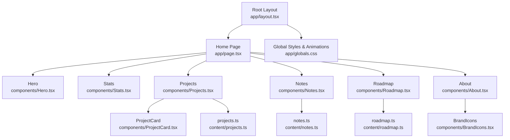
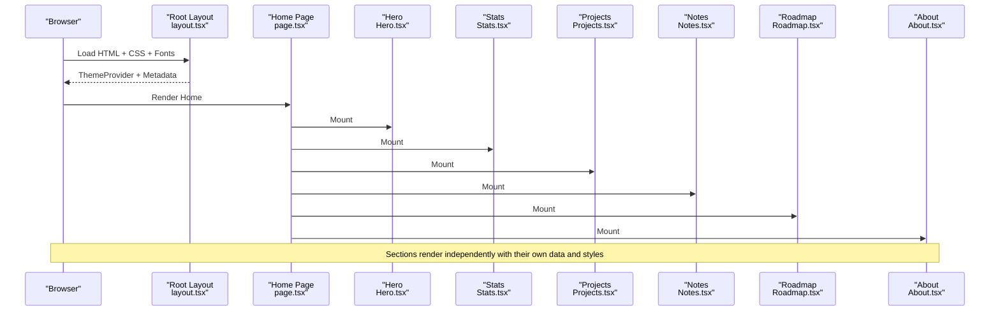
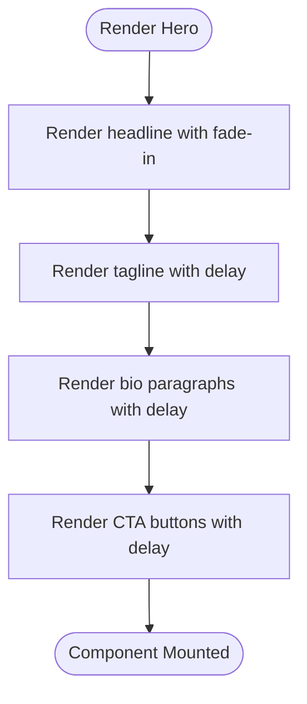
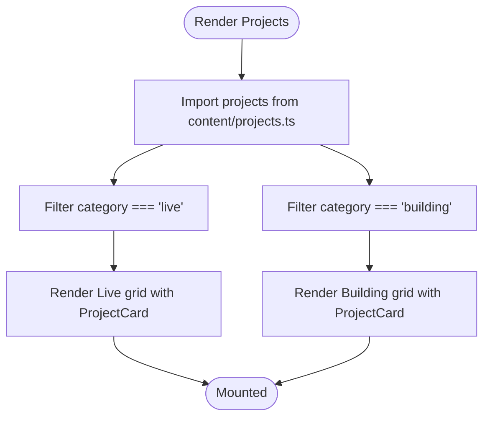
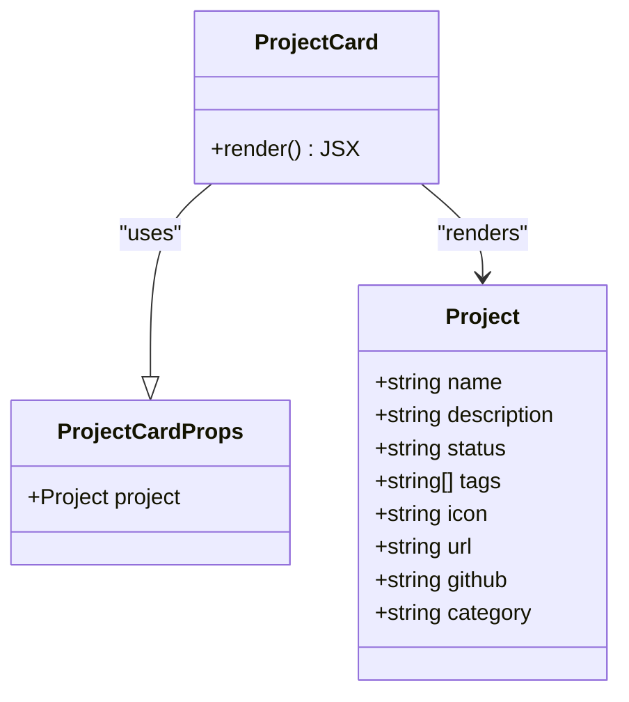
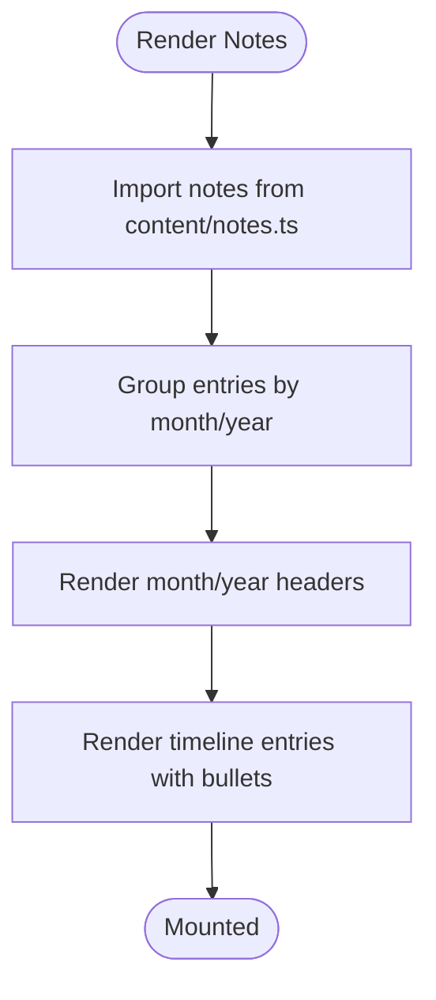
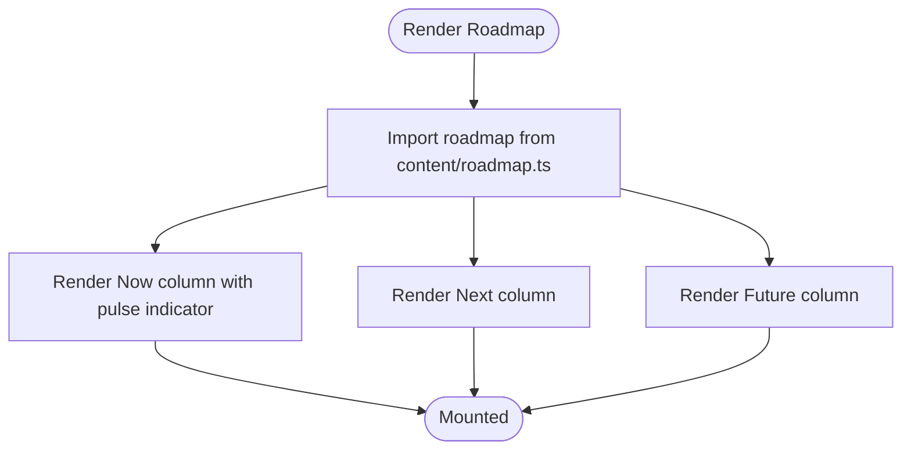
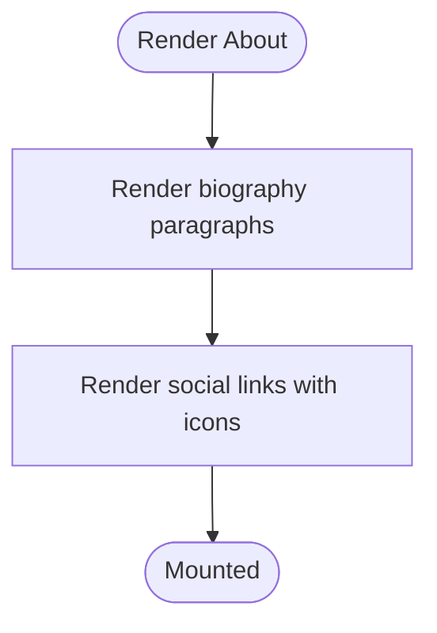
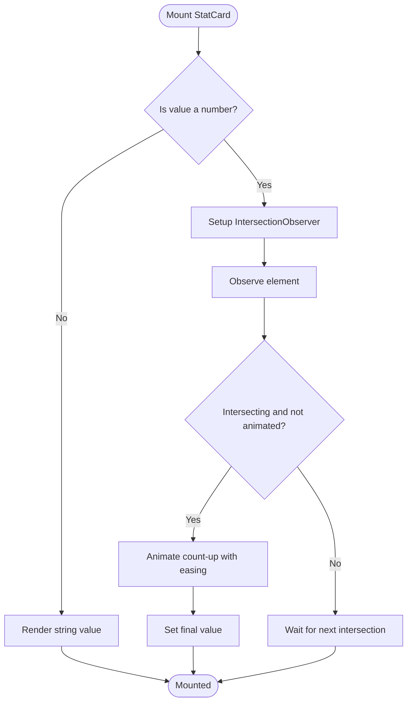
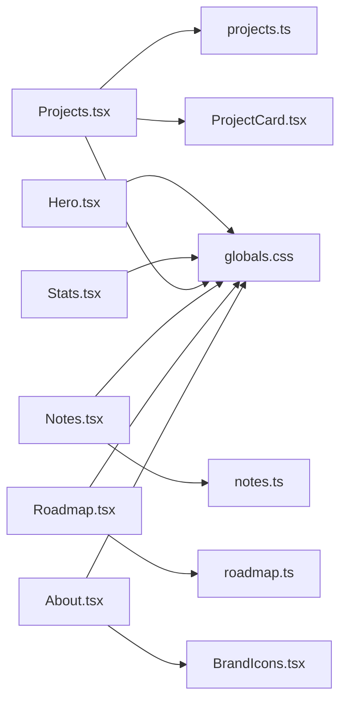

# Section Components

<cite>
**Referenced Files in This Document**
- [page.tsx](file://app/page.tsx)
- [layout.tsx](file://app/layout.tsx)
- [globals.css](file://app/globals.css)
- [Hero.tsx](file://components/Hero.tsx)
- [Projects.tsx](file://components/Projects.tsx)
- [ProjectCard.tsx](file://components/ProjectCard.tsx)
- [Notes.tsx](file://components/Notes.tsx)
- [Roadmap.tsx](file://components/Roadmap.tsx)
- [About.tsx](file://components/About.tsx)
- [Stats.tsx](file://components/Stats.tsx)
- [BrandIcons.tsx](file://components/BrandIcons.tsx)
- [projects.ts](file://content/projects.ts)
- [notes.ts](file://content/notes.ts)
- [roadmap.ts](file://content/roadmap.ts)
</cite>

## Table of Contents
1. [Introduction](#introduction)
2. [Project Structure](#project-structure)
3. [Core Components](#core-components)
4. [Architecture Overview](#architecture-overview)
5. [Detailed Component Analysis](#detailed-component-analysis)
6. [Dependency Analysis](#dependency-analysis)
7. [Performance Considerations](#performance-considerations)
8. [Troubleshooting Guide](#troubleshooting-guide)
9. [Conclusion](#conclusion)

## Introduction
This document provides comprehensive documentation for the main page section components that compose the portfolio website layout. It covers:
- Hero component with animated text effects and call-to-action buttons
- Projects component with project filtering (Live/Building), grid layout, and data integration from content/projects.ts
- Notes component with chronological timeline organization and monthly grouping
- Roadmap component with Now/Next/Future column visualization and status indicators
- About component with personal biography and social media integration
- Stats component with animated counters using Intersection Observer API

It includes prop interfaces, data structures, animation implementations, and responsive design patterns for each section component.

## Project Structure
The main page is composed by importing and rendering the following sections in order: Navigation, Hero, Stats, Projects, Notes, Roadmap, About, and Footer. The root layout configures fonts, theme provider, metadata, and schema.org JSON-LD.

**Diagram sources**
- [page.tsx:10-25](file://app/page.tsx#L10-L25)
- [layout.tsx:52-102](file://app/layout.tsx#L52-L102)
- [Hero.tsx:1-63](file://components/Hero.tsx#L1-L63)
- [Stats.tsx:1-85](file://components/Stats.tsx#L1-L85)
- [Projects.tsx:1-47](file://components/Projects.tsx#L1-L47)
- [ProjectCard.tsx:1-72](file://components/ProjectCard.tsx#L1-L72)
- [Notes.tsx:1-39](file://components/Notes.tsx#L1-L39)
- [Roadmap.tsx:1-81](file://components/Roadmap.tsx#L1-L81)
- [About.tsx:1-64](file://components/About.tsx#L1-L64)
- [BrandIcons.tsx:1-28](file://components/BrandIcons.tsx#L1-L28)
- [projects.ts:1-56](file://content/projects.ts#L1-L56)
- [notes.ts:1-19](file://content/notes.ts#L1-L19)
- [roadmap.ts:1-33](file://content/roadmap.ts#L1-L33)
- [globals.css:1-108](file://app/globals.css#L1-L108)

**Section sources**
- [page.tsx:10-25](file://app/page.tsx#L10-L25)
- [layout.tsx:52-102](file://app/layout.tsx#L52-L102)

## Core Components
- Hero: Presents a headline, tagline, descriptive paragraphs, and two call-to-action buttons linking to Projects and About. Uses CSS fade-in animations with staggered delays.
- Stats: Displays four stat cards with numeric or string values. Numeric values animate on scroll via Intersection Observer; strings render as-is.
- Projects: Filters projects into Live and Building categories and renders them in a responsive grid using ProjectCard.
- ProjectCard: Renders individual project details including icon, status badge, description, tags, and optional links.
- Notes: Groups notes by month/year and renders a vertical timeline with bullet markers.
- Roadmap: Visualizes three columns (Now, Next, Future) with distinct status indicators and item lists.
- About: Provides biography text and social links (LinkedIn, GitHub, external site).

**Section sources**
- [Hero.tsx:1-63](file://components/Hero.tsx#L1-L63)
- [Stats.tsx:1-85](file://components/Stats.tsx#L1-L85)
- [Projects.tsx:1-47](file://components/Projects.tsx#L1-L47)
- [ProjectCard.tsx:1-72](file://components/ProjectCard.tsx#L1-L72)
- [Notes.tsx:1-39](file://components/Notes.tsx#L1-L39)
- [Roadmap.tsx:1-81](file://components/Roadmap.tsx#L1-L81)
- [About.tsx:1-64](file://components/About.tsx#L1-L64)

## Architecture Overview
The Home page composes all section components. Each section is self-contained and reads its data either directly from local state or imported data modules. Styling and animations are provided by Tailwind utility classes and global CSS keyframes.

**Diagram sources**
- [layout.tsx:52-102](file://app/layout.tsx#L52-L102)
- [page.tsx:10-25](file://app/page.tsx#L10-L25)
- [Hero.tsx:1-63](file://components/Hero.tsx#L1-L63)
- [Stats.tsx:1-85](file://components/Stats.tsx#L1-L85)
- [Projects.tsx:1-47](file://components/Projects.tsx#L1-L47)
- [Notes.tsx:1-39](file://components/Notes.tsx#L1-L39)
- [Roadmap.tsx:1-81](file://components/Roadmap.tsx#L1-L81)
- [About.tsx:1-64](file://components/About.tsx#L1-L64)

## Detailed Component Analysis

### Hero Component
- Purpose: Introduce the studio with an animated headline, tagline, short bio, and CTAs to Projects and About.
- Props: None.
- Data: Static text content.
- Animations: Uses CSS class animate-fade-in with inline style animationDelay for staggered entrance.
- Responsive Design: Uses responsive font sizes and spacing utilities; stacks CTA buttons vertically on small screens and horizontally on larger screens.
- Accessibility: Semantic section and heading elements; anchor links use descriptive labels.

**Diagram sources**
- [Hero.tsx:10-58](file://components/Hero.tsx#L10-L58)
- [globals.css:68-81](file://app/globals.css#L68-L81)

**Section sources**
- [Hero.tsx:1-63](file://components/Hero.tsx#L1-L63)
- [globals.css:68-81](file://app/globals.css#L68-L81)

### Projects Component
- Purpose: Display featured projects grouped by category (Live and Building).
- Props: None.
- Data Integration: Imports projects array and types from content/projects.ts.
- Filtering Logic: Splits projects into liveProjects and buildingProjects based on category field.
- Rendering: Two sections with headings and responsive grids; each project rendered via ProjectCard.
- Responsive Design: Grid switches from single column to two columns at sm breakpoint.

**Diagram sources**
- [Projects.tsx:1-47](file://components/Projects.tsx#L1-L47)
- [projects.ts:1-56](file://content/projects.ts#L1-L56)
- [ProjectCard.tsx:1-72](file://components/ProjectCard.tsx#L1-L72)

**Section sources**
- [Projects.tsx:1-47](file://components/Projects.tsx#L1-L47)
- [projects.ts:1-56](file://content/projects.ts#L1-L56)
- [ProjectCard.tsx:1-72](file://components/ProjectCard.tsx#L1-L72)

#### ProjectCard Component
- Props:
  - project: Project object from content/projects.ts
- Data Structures:
  - Project interface includes name, description, status, tags, icon, url, github, category.
- Status Badge: Maps status values to color variants.
- Links: Conditionally renders Visit Project and GitHub links when urls exist.
- Responsive Design: Card padding, typography, and spacing adapt across breakpoints.

**Diagram sources**
- [ProjectCard.tsx:1-72](file://components/ProjectCard.tsx#L1-L72)
- [projects.ts:1-56](file://content/projects.ts#L1-L56)

**Section sources**
- [ProjectCard.tsx:1-72](file://components/ProjectCard.tsx#L1-L72)
- [projects.ts:1-56](file://content/projects.ts#L1-L56)

### Notes Component
- Purpose: Show recent updates organized chronologically by month and year.
- Props: None.
- Data Integration: Imports notes array from content/notes.ts.
- Organization: Each note group displays a header with month and year, followed by a timeline list of entries.
- Timeline Styling: Left border line and accent-colored dots for each entry.
- Responsive Design: Centered container with max width and consistent spacing.

**Diagram sources**
- [Notes.tsx:1-39](file://components/Notes.tsx#L1-L39)
- [notes.ts:1-19](file://content/notes.ts#L1-L19)

**Section sources**
- [Notes.tsx:1-39](file://components/Notes.tsx#L1-L39)
- [notes.ts:1-19](file://content/notes.ts#L1-L19)

### Roadmap Component
- Purpose: Present current, upcoming, and future initiatives in a three-column layout.
- Props: None.
- Data Integration: Imports roadmap object from content/roadmap.ts.
- Columns:
  - Now: Accent-colored pulsing indicator and items.
  - Next: Standard secondary-text indicators and items.
  - Future: Faded indicators and items.
- Responsive Design: Three-column grid at md breakpoint; stacks below on smaller screens.

**Diagram sources**
- [Roadmap.tsx:1-81](file://components/Roadmap.tsx#L1-L81)
- [roadmap.ts:1-33](file://content/roadmap.ts#L1-L33)

**Section sources**
- [Roadmap.tsx:1-81](file://components/Roadmap.tsx#L1-L81)
- [roadmap.ts:1-33](file://content/roadmap.ts#L1-L33)

### About Component
- Purpose: Provide a concise biography and link to social profiles.
- Props: None.
- Social Integration: Uses custom SVG icons for LinkedIn and GitHub; includes an external link button.
- Responsive Design: Centered layout with consistent spacing and hover states.

**Diagram sources**
- [About.tsx:1-64](file://components/About.tsx#L1-L64)
- [BrandIcons.tsx:1-28](file://components/BrandIcons.tsx#L1-L28)

**Section sources**
- [About.tsx:1-64](file://components/About.tsx#L1-L64)
- [BrandIcons.tsx:1-28](file://components/BrandIcons.tsx#L1-L28)

### Stats Component
- Purpose: Showcase key metrics with animated counters for numeric values.
- Props:
  - StatCard props: label (string), value (number|string), suffix (optional string)
- Animation Implementation:
  - Uses IntersectionObserver to detect visibility.
  - On first intersection, animates numeric values from 0 to target over a fixed duration with easing.
  - Skips animation for string values.
- Responsive Design: Grid adapts from 2 columns to 4 columns at sm breakpoint.

**Diagram sources**
- [Stats.tsx:11-69](file://components/Stats.tsx#L11-L69)

**Section sources**
- [Stats.tsx:1-85](file://components/Stats.tsx#L1-L85)

## Dependency Analysis
The following diagram shows how components depend on data modules and shared assets.

**Diagram sources**
- [Projects.tsx:1-47](file://components/Projects.tsx#L1-L47)
- [ProjectCard.tsx:1-72](file://components/ProjectCard.tsx#L1-L72)
- [projects.ts:1-56](file://content/projects.ts#L1-L56)
- [Notes.tsx:1-39](file://components/Notes.tsx#L1-L39)
- [notes.ts:1-19](file://content/notes.ts#L1-L19)
- [Roadmap.tsx:1-81](file://components/Roadmap.tsx#L1-L81)
- [roadmap.ts:1-33](file://content/roadmap.ts#L1-L33)
- [About.tsx:1-64](file://components/About.tsx#L1-L64)
- [BrandIcons.tsx:1-28](file://components/BrandIcons.tsx#L1-L28)
- [Hero.tsx:1-63](file://components/Hero.tsx#L1-L63)
- [Stats.tsx:1-85](file://components/Stats.tsx#L1-L85)
- [globals.css:1-108](file://app/globals.css#L1-L108)

**Section sources**
- [projects.ts:1-56](file://content/projects.ts#L1-L56)
- [notes.ts:1-19](file://content/notes.ts#L1-L19)
- [roadmap.ts:1-33](file://content/roadmap.ts#L1-L33)
- [BrandIcons.tsx:1-28](file://components/BrandIcons.tsx#L1-L28)
- [globals.css:1-108](file://app/globals.css#L1-L108)

## Performance Considerations
- IntersectionObserver usage in Stats ensures animations run only once per card and avoid unnecessary re-renders.
- Staggered CSS animations in Hero reduce perceived load time without heavy JS overhead.
- Filtering projects in-memory is efficient given the small dataset size.
- Using semantic HTML and minimal DOM nesting improves accessibility and rendering performance.

[No sources needed since this section provides general guidance]

## Troubleshooting Guide
- Missing data fields: Ensure all required fields exist in content files (e.g., projects must include category, status, tags).
- Broken links: Verify url and github fields in projects and hrefs in About are correct.
- Animation not triggering: Confirm Stats cards are visible within viewport; adjust observer threshold if needed.
- Styling conflicts: Tailwind classes rely on global CSS variables; ensure theme variables are defined and dark mode toggles correctly.

**Section sources**
- [projects.ts:1-56](file://content/projects.ts#L1-L56)
- [notes.ts:1-19](file://content/notes.ts#L1-L19)
- [roadmap.ts:1-33](file://content/roadmap.ts#L1-L33)
- [About.tsx:1-64](file://components/About.tsx#L1-L64)
- [Stats.tsx:11-69](file://components/Stats.tsx#L11-L69)
- [globals.css:1-108](file://app/globals.css#L1-L108)

## Conclusion
The main page section components form a cohesive, modular portfolio layout. Each section is self-contained, uses clear data structures, and applies responsive design and subtle animations to enhance user experience. The architecture promotes maintainability through separation of concerns and reusable components.

[No sources needed since this section summarizes without analyzing specific files]