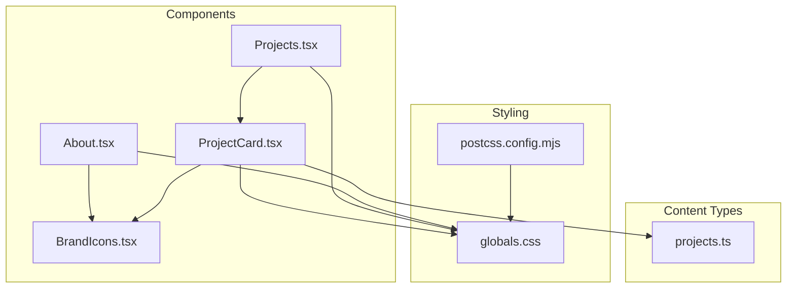
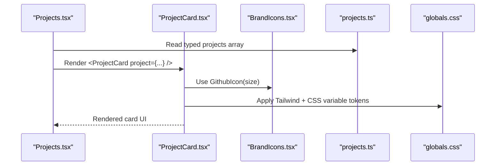
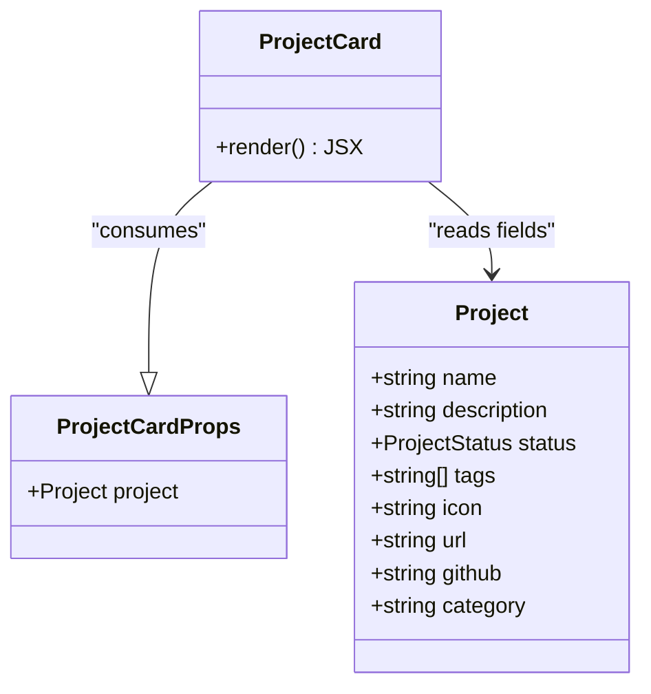
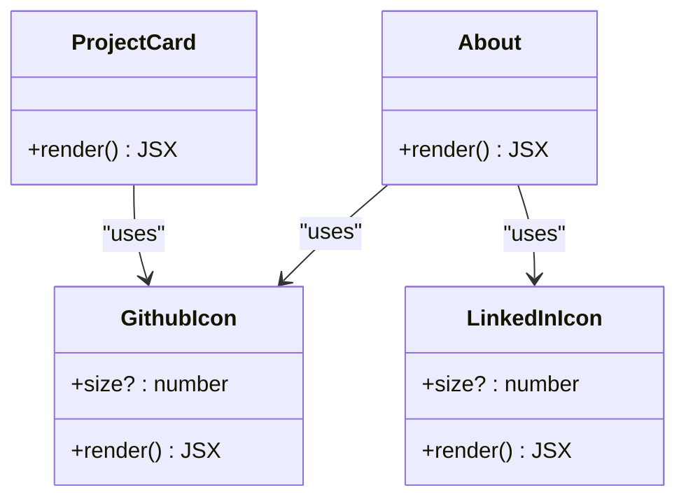
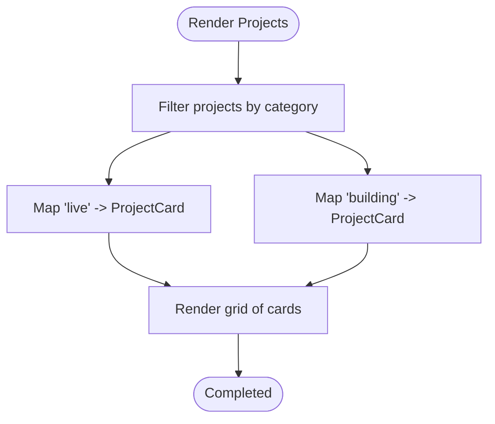
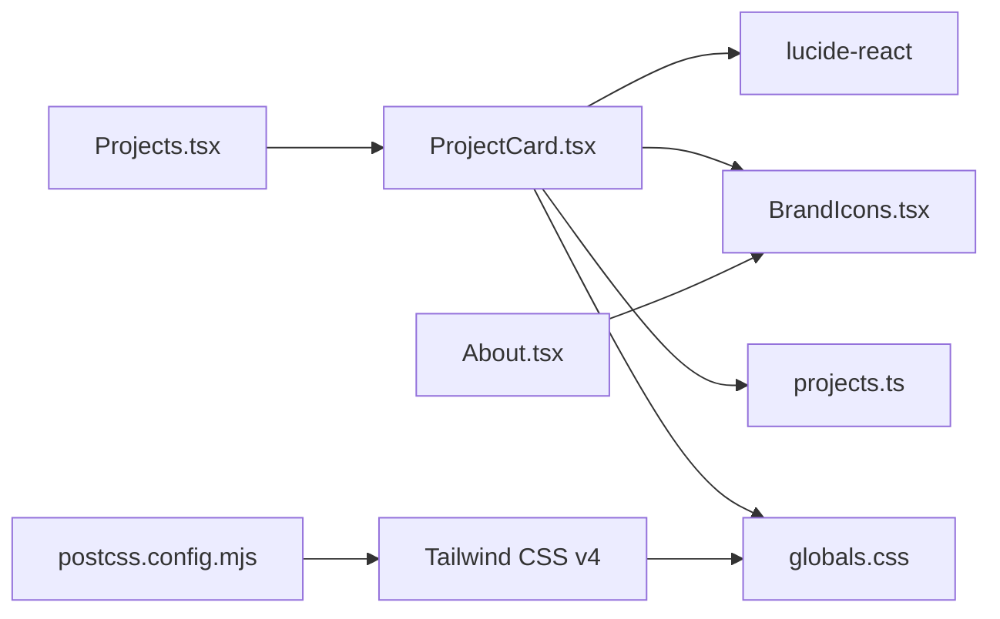

# Utility Components

<cite>
**Referenced Files in This Document**
- [ProjectCard.tsx](file://components/ProjectCard.tsx)
- [BrandIcons.tsx](file://components/BrandIcons.tsx)
- [projects.ts](file://content/projects.ts)
- [Projects.tsx](file://components/Projects.tsx)
- [About.tsx](file://components/About.tsx)
- [globals.css](file://app/globals.css)
- [postcss.config.mjs](file://postcss.config.mjs)
- [package.json](file://package.json)
</cite>

## Table of Contents
1. [Introduction](#introduction)
2. [Project Structure](#project-structure)
3. [Core Components](#core-components)
4. [Architecture Overview](#architecture-overview)
5. [Detailed Component Analysis](#detailed-component-analysis)
6. [Dependency Analysis](#dependency-analysis)
7. [Performance Considerations](#performance-considerations)
8. [Troubleshooting Guide](#troubleshooting-guide)
9. [Conclusion](#conclusion)

## Introduction
This document provides detailed documentation for reusable utility components used across the portfolio website: ProjectCard and BrandIcons. It covers TypeScript interfaces, prop contracts, styling approaches with Tailwind CSS, accessibility considerations for interactive elements, and usage examples showing how these components are composed within larger section components such as Projects and About.

## Project Structure
The project is a Next.js application using React and Tailwind CSS v4. The utility components live under components/, while shared data types and content reside under content/. Global theme tokens and animations are defined in app/globals.css and processed via Tailwind’s PostCSS plugin.

**Diagram sources**
- [ProjectCard.tsx:1-72](file://components/ProjectCard.tsx#L1-L72)
- [BrandIcons.tsx:1-28](file://components/BrandIcons.tsx#L1-L28)
- [Projects.tsx:1-47](file://components/Projects.tsx#L1-L47)
- [About.tsx:1-64](file://components/About.tsx#L1-L64)
- [projects.ts:1-56](file://content/projects.ts#L1-L56)
- [globals.css:1-108](file://app/globals.css#L1-L108)
- [postcss.config.mjs:1-7](file://postcss.config.mjs#L1-L7)

**Section sources**
- [package.json:1-29](file://package.json#L1-L29)
- [postcss.config.mjs:1-7](file://postcss.config.mjs#L1-L7)
- [globals.css:1-108](file://app/globals.css#L1-L108)

## Core Components
- ProjectCard: A presentational card that displays project metadata (icon, name, description), status badge, tags, and external links (website and GitHub). It consumes typed project data and applies consistent Tailwind-based styling.
- BrandIcons: A small library of custom SVG icon components (e.g., GithubIcon, LinkedInIcon) with a uniform size prop and fill behavior, enabling consistent branding across the site.

Key characteristics:
- Strong typing via TypeScript interfaces and union types.
- Declarative rendering driven by props and data models.
- Styling through Tailwind utility classes and CSS variables for theming.
- Accessibility-friendly patterns for external links and icons.

**Section sources**
- [ProjectCard.tsx:1-72](file://components/ProjectCard.tsx#L1-L72)
- [BrandIcons.tsx:1-28](file://components/BrandIcons.tsx#L1-L28)
- [projects.ts:1-56](file://content/projects.ts#L1-L56)

## Architecture Overview
The following diagram shows how the utility components integrate into the page composition layer and consume shared data and styles.

**Diagram sources**
- [Projects.tsx:1-47](file://components/Projects.tsx#L1-L47)
- [ProjectCard.tsx:1-72](file://components/ProjectCard.tsx#L1-L72)
- [BrandIcons.tsx:1-28](file://components/BrandIcons.tsx#L1-L28)
- [projects.ts:1-56](file://content/projects.ts#L1-L56)
- [globals.css:1-108](file://app/globals.css#L1-L108)

## Detailed Component Analysis

### ProjectCard
Purpose:
- Displays a single project entry with metadata, status badge, technology tags, and optional external links.

Props interface:
- project: Project (from content/projects.ts)

Project type contract:
- name: string
- description: string
- status: "Live" | "Building" | "Planning"
- tags: string[]
- icon: string
- url?: string
- github?: string
- category: "live" | "building"

Rendering logic highlights:
- Status badge: Uses a mapping from status to Tailwind color classes to render contextual badges.
- Tags: Maps over tags to render lightweight pill labels.
- External links: Conditionally renders “Visit Project” when url is provided and “GitHub” when github is provided. Both use target="_blank" and rel="noopener noreferrer".

Accessibility considerations:
- External links include rel="noopener noreferrer" for security and performance.
- Icon-only buttons should ideally have accessible names; consider adding aria-label where appropriate if text is omitted.

Styling approach:
- Uses Tailwind utilities for layout, spacing, typography, borders, shadows, and hover states.
- Relies on CSS variables exposed via Tailwind theme tokens (e.g., background, foreground, accent, card-border) for consistent theming and dark mode support.

Usage example:
- Composed inside Projects.tsx, which filters projects by category and maps each item to a ProjectCard.

**Diagram sources**
- [ProjectCard.tsx:5-7](file://components/ProjectCard.tsx#L5-L7)
- [ProjectCard.tsx:15-71](file://components/ProjectCard.tsx#L15-L71)
- [projects.ts:1-12](file://content/projects.ts#L1-L12)

**Section sources**
- [ProjectCard.tsx:1-72](file://components/ProjectCard.tsx#L1-L72)
- [projects.ts:1-56](file://content/projects.ts#L1-L56)
- [Projects.tsx:1-47](file://components/Projects.tsx#L1-L47)
- [globals.css:29-40](file://app/globals.css#L29-L40)

### BrandIcons
Purpose:
- Provides reusable, consistently styled SVG icons for brand surfaces (e.g., GitHub, LinkedIn).

Interface pattern:
- Each icon component accepts an optional size prop (number) with a default value.
- Icons use fill="currentColor" so they inherit text color, aligning with theme tokens.

Available icons:
- GithubIcon({ size })
- LinkedInIcon({ size })

Styling approach:
- Inline SVG attributes control dimensions and fill.
- Color inheritance ensures alignment with current text color and theme tokens.

Usage examples:
- Used directly in About.tsx for social links.
- Used in ProjectCard.tsx for the GitHub link button.

**Diagram sources**
- [BrandIcons.tsx:1-28](file://components/BrandIcons.tsx#L1-L28)
- [About.tsx:1-64](file://components/About.tsx#L1-L64)
- [ProjectCard.tsx:1-72](file://components/ProjectCard.tsx#L1-L72)

**Section sources**
- [BrandIcons.tsx:1-28](file://components/BrandIcons.tsx#L1-L28)
- [About.tsx:1-64](file://components/About.tsx#L1-L64)
- [ProjectCard.tsx:1-72](file://components/ProjectCard.tsx#L1-L72)

### Composition in Section Components
Projects.tsx demonstrates composition:
- Filters the typed projects list into categories.
- Renders two grids: Live and Building.
- Maps each project to a ProjectCard, passing the full typed object.

About.tsx demonstrates icon composition:
- Imports and uses BrandIcons for social links.
- Applies consistent button-like styling with Tailwind utilities.

**Diagram sources**
- [Projects.tsx:4-46](file://components/Projects.tsx#L4-L46)
- [ProjectCard.tsx:15-71](file://components/ProjectCard.tsx#L15-L71)

**Section sources**
- [Projects.tsx:1-47](file://components/Projects.tsx#L1-L47)
- [About.tsx:1-64](file://components/About.tsx#L1-L64)

## Dependency Analysis
External dependencies relevant to these components:
- lucide-react: Used for generic icons like ExternalLink.
- Tailwind CSS v4: Utility-first styling with CSS variables for theming.
- PostCSS plugin @tailwindcss/postcss: Processes Tailwind directives.

**Diagram sources**
- [ProjectCard.tsx:1-72](file://components/ProjectCard.tsx#L1-L72)
- [BrandIcons.tsx:1-28](file://components/BrandIcons.tsx#L1-L28)
- [projects.ts:1-56](file://content/projects.ts#L1-L56)
- [Projects.tsx:1-47](file://components/Projects.tsx#L1-L47)
- [About.tsx:1-64](file://components/About.tsx#L1-L64)
- [globals.css:1-108](file://app/globals.css#L1-L108)
- [postcss.config.mjs:1-7](file://postcss.config.mjs#L1-L7)
- [package.json:11-27](file://package.json#L11-L27)

**Section sources**
- [package.json:11-27](file://package.json#L11-L27)
- [postcss.config.mjs:1-7](file://postcss.config.mjs#L1-L7)
- [globals.css:1-108](file://app/globals.css#L1-L108)

## Performance Considerations
- Static SVGs: BrandIcons are inline SVGs with minimal DOM overhead. Keep sizes reasonable and reuse components to avoid duplication.
- Conditional rendering: ProjectCard conditionally renders links only when data is present, avoiding unnecessary DOM nodes.
- List keys: Using stable identifiers (e.g., project.name) helps React optimize re-renders. Prefer unique IDs if available.
- Theme tokens: Leveraging CSS variables avoids heavy style recalculation during theme switches.

[No sources needed since this section provides general guidance]

## Troubleshooting Guide
Common issues and resolutions:
- Missing external link behavior: Ensure all external links include target="_blank" and rel="noopener noreferrer" to prevent tab-nabbing and improve performance.
- Inconsistent icon sizing: Always pass a size prop to BrandIcons or rely on defaults; verify inherited color via currentColor.
- Status badge colors not applying: Confirm that project.status matches one of the expected values ("Live", "Building", "Planning") and that the mapping exists.
- Theme token mismatches: Verify that globals.css defines the required CSS variables and that Tailwind theme mappings are present.

**Section sources**
- [ProjectCard.tsx:45-67](file://components/ProjectCard.tsx#L45-L67)
- [BrandIcons.tsx:1-28](file://components/BrandIcons.tsx#L1-L28)
- [globals.css:29-40](file://app/globals.css#L29-L40)

## Conclusion
ProjectCard and BrandIcons provide a robust foundation for displaying project information and maintaining consistent iconography across the portfolio site. Their design emphasizes strong typing, clear prop contracts, composable structure, and accessible interaction patterns. Tailwind CSS and CSS variables enable flexible theming and maintainable styling. By adhering to the documented interfaces and patterns, additional sections can be built quickly while preserving visual and behavioral consistency.