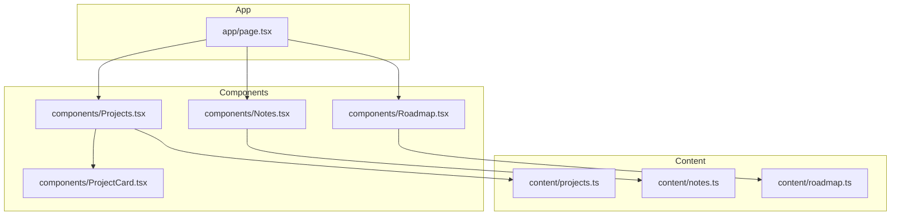
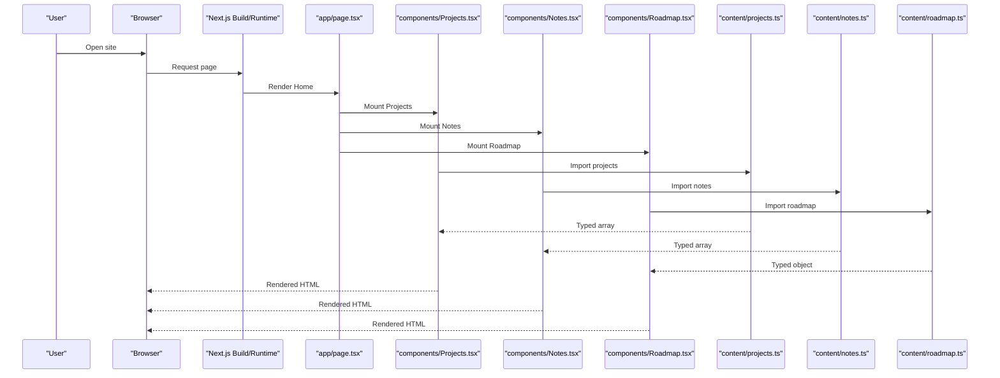
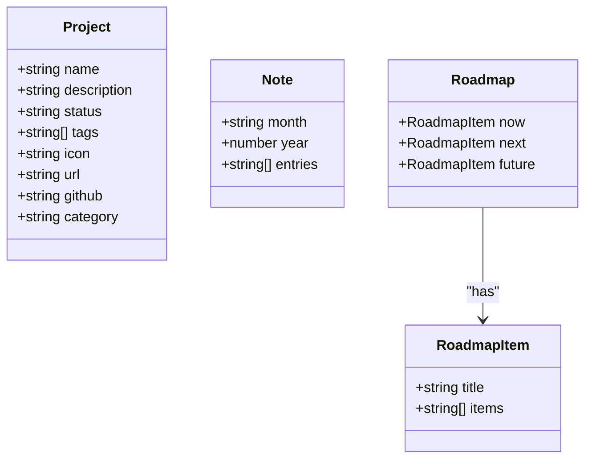
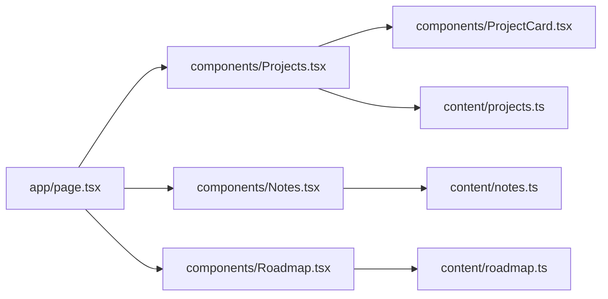

# Content Management

<cite>
**Referenced Files in This Document**
- [content/projects.ts](file://content/projects.ts)
- [content/notes.ts](file://content/notes.ts)
- [content/roadmap.ts](file://content/roadmap.ts)
- [components/Projects.tsx](file://components/Projects.tsx)
- [components/Notes.tsx](file://components/Notes.tsx)
- [components/Roadmap.tsx](file://components/Roadmap.tsx)
- [components/ProjectCard.tsx](file://components/ProjectCard.tsx)
- [app/page.tsx](file://app/page.tsx)
- [package.json](file://package.json)
</cite>

## Table of Contents
1. [Introduction](#introduction)
2. [Project Structure](#project-structure)
3. [Core Components](#core-components)
4. [Architecture Overview](#architecture-overview)
5. [Detailed Component Analysis](#detailed-component-analysis)
6. [Dependency Analysis](#dependency-analysis)
7. [Performance Considerations](#performance-considerations)
8. [Troubleshooting Guide](#troubleshooting-guide)
9. [Conclusion](#conclusion)

## Introduction
This document explains the content-driven architecture of the Han Neng portfolio website. All dynamic content is separated from presentation logic and stored in dedicated TypeScript files under the content directory. The React components consume these data modules to render pages, ensuring a clear separation between content and UI. This approach simplifies updates, improves consistency, and makes it easy to maintain large amounts of information.

## Project Structure
The site follows a simple, scalable structure:
- content: Centralized data modules for projects, notes, and roadmap
- components: Reusable UI components that consume content
- app: Next.js application entry points and page composition

**Diagram sources**
- [app/page.tsx:10-25](file://app/page.tsx#L10-L25)
- [components/Projects.tsx:1-47](file://components/Projects.tsx#L1-L47)
- [components/Notes.tsx:1-39](file://components/Notes.tsx#L1-L39)
- [components/Roadmap.tsx:1-81](file://components/Roadmap.tsx#L1-L81)
- [components/ProjectCard.tsx:1-72](file://components/ProjectCard.tsx#L1-L72)
- [content/projects.ts:1-56](file://content/projects.ts#L1-L56)
- [content/notes.ts:1-19](file://content/notes.ts#L1-L19)
- [content/roadmap.ts:1-33](file://content/roadmap.ts#L1-L33)

**Section sources**
- [app/page.tsx:10-25](file://app/page.tsx#L10-L25)
- [components/Projects.tsx:1-47](file://components/Projects.tsx#L1-L47)
- [components/Notes.tsx:1-39](file://components/Notes.tsx#L1-L39)
- [components/Roadmap.tsx:1-81](file://components/Roadmap.tsx#L1-L81)
- [components/ProjectCard.tsx:1-72](file://components/ProjectCard.tsx#L1-L72)
- [content/projects.ts:1-56](file://content/projects.ts#L1-L56)
- [content/notes.ts:1-19](file://content/notes.ts#L1-L19)
- [content/roadmap.ts:1-33](file://content/roadmap.ts#L1-L33)

## Core Components
- Projects component renders live and building projects by filtering the exported array from the projects module and mapping each item to a card component.
- Notes component renders chronological monthly groups with entries.
- Roadmap component renders Now/Next/Future categories as three columns.
- ProjectCard displays project details, status badge, tags, and links.

Key responsibilities:
- Data consumption: Each component imports its data module and renders lists based on the shape defined by interfaces.
- Filtering and grouping: Projects are split into two sections; Notes are grouped by month/year; Roadmap is organized by category.
- Presentation-only: Components do not mutate or validate content; they assume well-formed data according to the shared interfaces.

**Section sources**
- [components/Projects.tsx:1-47](file://components/Projects.tsx#L1-L47)
- [components/Notes.tsx:1-39](file://components/Notes.tsx#L1-L39)
- [components/Roadmap.tsx:1-81](file://components/Roadmap.tsx#L1-L81)
- [components/ProjectCard.tsx:1-72](file://components/ProjectCard.tsx#L1-L72)

## Architecture Overview
The site uses a content-first architecture:
- Data layer: TypeScript modules export typed arrays and objects.
- UI layer: React components import and render data without business logic.
- Composition: The root page composes all sections.

**Diagram sources**
- [app/page.tsx:10-25](file://app/page.tsx#L10-L25)
- [components/Projects.tsx:1-47](file://components/Projects.tsx#L1-L47)
- [components/Notes.tsx:1-39](file://components/Notes.tsx#L1-L39)
- [components/Roadmap.tsx:1-81](file://components/Roadmap.tsx#L1-L81)
- [content/projects.ts:1-56](file://content/projects.ts#L1-L56)
- [content/notes.ts:1-19](file://content/notes.ts#L1-L19)
- [content/roadmap.ts:1-33](file://content/roadmap.ts#L1-L33)

## Detailed Component Analysis

### Data Models and Interfaces
- Project model defines fields for name, description, status, tags, icon, optional url and github, and category used for rendering sections.
- Note model organizes entries by month and year.
- Roadmap model defines three categories (now, next, future), each with a title and items list.

**Diagram sources**
- [content/projects.ts:1-12](file://content/projects.ts#L1-L12)
- [content/notes.ts:1-5](file://content/notes.ts#L1-L5)
- [content/roadmap.ts:1-4](file://content/roadmap.ts#L1-L4)

**Section sources**
- [content/projects.ts:1-12](file://content/projects.ts#L1-L12)
- [content/notes.ts:1-5](file://content/notes.ts#L1-L5)
- [content/roadmap.ts:1-4](file://content/roadmap.ts#L1-L4)

### Adding a New Project
Follow these steps to add a new project:
1. Open the projects data file.
2. Add a new object to the exported array using the required fields:
   - name: string
   - description: string
   - status: one of the allowed values
   - tags: array of strings
   - icon: string
   - category: either live or building
   - Optional: url and github
3. Save the file. The Projects component will automatically render the new project in the appropriate section.

Validation and constraints:
- Status must be one of the allowed values.
- Category determines which section the project appears in.
- Optional links should only be provided when available.

Best practices:
- Keep descriptions concise and consistent in tone.
- Use meaningful tags aligned with existing ones.
- Ensure icons are relevant and visually consistent.

**Section sources**
- [content/projects.ts:1-56](file://content/projects.ts#L1-L56)
- [components/Projects.tsx:1-47](file://components/Projects.tsx#L1-L47)
- [components/ProjectCard.tsx:1-72](file://components/ProjectCard.tsx#L1-L72)

### Updating Development Notes
To add development notes:
1. Open the notes data file.
2. Create a new note object with:
   - month: string
   - year: number
   - entries: array of strings
3. Place the new note at the top of the array to keep recent months first.
4. Save the file. The Notes component will render the new month group with its entries.

Chronological organization:
- Maintain descending order by date (newest first).
- Group entries by month and year.
- Keep entries short and action-oriented.

**Section sources**
- [content/notes.ts:1-19](file://content/notes.ts#L1-L19)
- [components/Notes.tsx:1-39](file://components/Notes.tsx#L1-L39)

### Roadmap Structure and Updates
The roadmap is divided into three categories:
- Now: current priorities
- Next: upcoming work
- Future: long-term ideas

To update:
1. Open the roadmap data file.
2. Edit the items arrays within the desired category.
3. Optionally adjust titles if needed.
4. Save the file. The Roadmap component will reflect changes immediately.

Status indicators:
- The UI visually distinguishes categories through styling and markers.
- Keep items concise and outcome-focused.

**Section sources**
- [content/roadmap.ts:1-33](file://content/roadmap.ts#L1-L33)
- [components/Roadmap.tsx:1-81](file://components/Roadmap.tsx#L1-L81)

### Example Usage Patterns and Validation
TypeScript enforces correct shapes:
- For projects, ensure status matches the allowed union type and category is valid.
- For notes, ensure entries is an array of strings and month/year are present.
- For roadmap, ensure each category has a title and items array.

Recommended validation patterns:
- Prefer strict typing over runtime checks where possible.
- If additional rules are needed, consider adding small helper functions in the content files to normalize or validate before export.

**Section sources**
- [content/projects.ts:1-12](file://content/projects.ts#L1-L12)
- [content/notes.ts:1-5](file://content/notes.ts#L1-L5)
- [content/roadmap.ts:1-4](file://content/roadmap.ts#L1-L4)

### Best Practices for Consistency and Organization
- Naming conventions: Use consistent naming for keys and values across content files.
- Tag normalization: Standardize tag names to avoid duplicates (e.g., “AI” vs “Artificial Intelligence”).
- Descriptions: Keep length and style consistent across projects.
- Ordering: Keep newest notes first and roadmap items prioritized logically.
- Icons: Choose expressive but lightweight emoji or symbols consistently.
- Links: Only include url and github when available; leave empty strings otherwise.

[No sources needed since this section provides general guidance]

## Dependency Analysis
The following diagram shows how components depend on content modules and how the page composes them.

**Diagram sources**
- [app/page.tsx:10-25](file://app/page.tsx#L10-L25)
- [components/Projects.tsx:1-47](file://components/Projects.tsx#L1-L47)
- [components/Notes.tsx:1-39](file://components/Notes.tsx#L1-L39)
- [components/Roadmap.tsx:1-81](file://components/Roadmap.tsx#L1-L81)
- [components/ProjectCard.tsx:1-72](file://components/ProjectCard.tsx#L1-L72)
- [content/projects.ts:1-56](file://content/projects.ts#L1-L56)
- [content/notes.ts:1-19](file://content/notes.ts#L1-L19)
- [content/roadmap.ts:1-33](file://content/roadmap.ts#L1-L33)

**Section sources**
- [app/page.tsx:10-25](file://app/page.tsx#L10-L25)
- [components/Projects.tsx:1-47](file://components/Projects.tsx#L1-L47)
- [components/Notes.tsx:1-39](file://components/Notes.tsx#L1-L39)
- [components/Roadmap.tsx:1-81](file://components/Roadmap.tsx#L1-L81)
- [components/ProjectCard.tsx:1-72](file://components/ProjectCard.tsx#L1-L72)
- [content/projects.ts:1-56](file://content/projects.ts#L1-L56)
- [content/notes.ts:1-19](file://content/notes.ts#L1-L19)
- [content/roadmap.ts:1-33](file://content/roadmap.ts#L1-L33)

## Performance Considerations
- Static data: Content modules are plain TypeScript exports, making them fast to import and render.
- Minimal processing: Components perform simple filtering and mapping, keeping rendering efficient.
- Build-time optimization: Next.js compiles and optimizes static assets during build.

[No sources needed since this section provides general guidance]

## Troubleshooting Guide
Common issues and resolutions:
- Type errors after editing content:
  - Ensure new entries match the interface shapes exactly.
  - Verify enum-like unions for status and category are respected.
- Missing or extra fields:
  - Remove optional fields if not applicable or provide empty strings for url/github.
- Rendering anomalies:
  - Check that arrays are properly closed and commas are correct.
  - Confirm that month/year are provided for notes and that entries is an array.
- Build failures:
  - Run the build script to catch type errors early.
  - Fix reported types in the content files.

Operational references:
- Build command: see scripts in package configuration.
- Local development: use the dev script to preview changes instantly.

**Section sources**
- [content/projects.ts:1-56](file://content/projects.ts#L1-L56)
- [content/notes.ts:1-19](file://content/notes.ts#L1-L19)
- [content/roadmap.ts:1-33](file://content/roadmap.ts#L1-L33)
- [package.json:5-10](file://package.json#L5-L10)

## Conclusion
The Han Neng portfolio website uses a clean, content-driven architecture that separates data from presentation. By maintaining structured TypeScript modules for projects, notes, and roadmap, contributors can update content safely and consistently. The React components remain focused on rendering, while TypeScript ensures correctness. This design scales well as content grows and simplifies maintenance and collaboration.