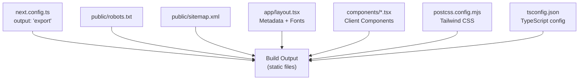
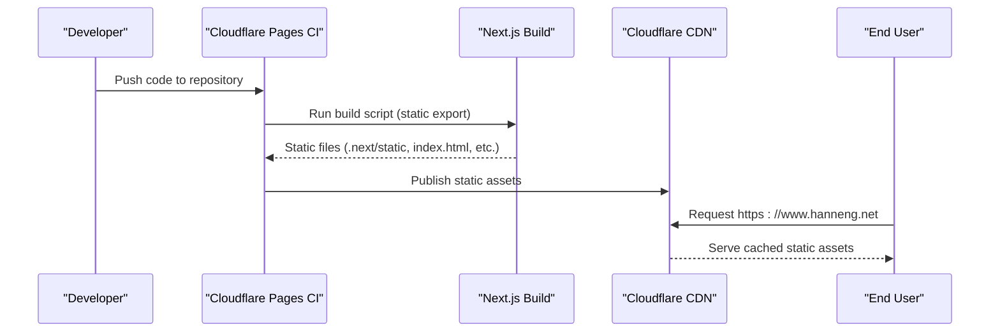
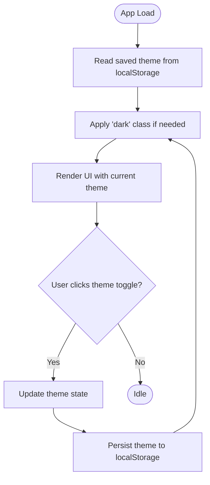
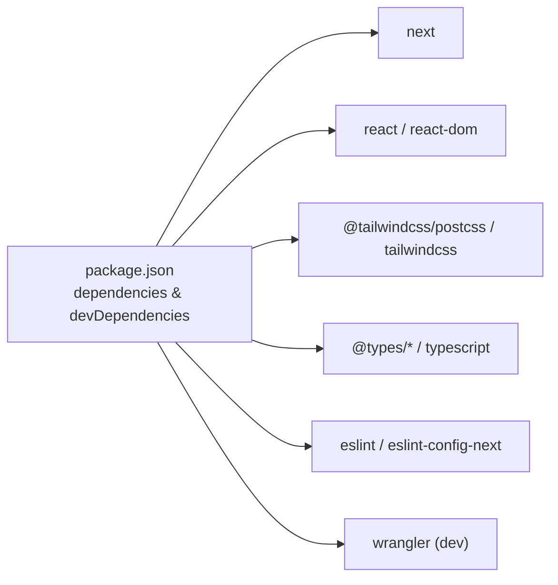

# Deployment and Production

<cite>
**Referenced Files in This Document**
- [next.config.ts](file://next.config.ts)
- [package.json](file://package.json)
- [app/layout.tsx](file://app/layout.tsx)
- [public/robots.txt](file://public/robots.txt)
- [public/sitemap.xml](file://public/sitemap.xml)
- [components/ThemeProvider.tsx](file://components/ThemeProvider.tsx)
- [components/Navigation.tsx](file://components/Navigation.tsx)
- [app/page.tsx](file://app/page.tsx)
- [postcss.config.mjs](file://postcss.config.mjs)
- [tsconfig.json](file://tsconfig.json)
</cite>

## Table of Contents
1. Introduction
2. Project Structure
3. Core Components
4. Architecture Overview
5. Detailed Component Analysis
6. Dependency Analysis
7. Performance Considerations
8. Troubleshooting Guide
9. Conclusion

## Introduction
This document provides comprehensive deployment and production guidance for the Han Neng portfolio website. It focuses on:
- Static site export using Next.js static generation for optimal performance and CDN distribution
- Cloudflare Pages deployment setup, including environment configuration and build process optimization
- SEO considerations with robots.txt and sitemap.xml
- Performance optimization strategies (images, fonts, bundle size)
- Monitoring and analytics integration points
- Security considerations for static sites
- Troubleshooting guides for common deployment issues and debugging techniques

## Project Structure
The project is a Next.js application configured to export a fully static site. The root configuration enables static output, while public assets such as robots.txt and sitemap.xml are served directly by the CDN. Client-side interactivity is implemented via React components marked as client components.

**Diagram sources**
- [next.config.ts:1-8](file://next.config.ts#L1-L8)
- [public/robots.txt:1-5](file://public/robots.txt#L1-L5)
- [public/sitemap.xml:1-10](file://public/sitemap.xml#L1-L10)
- [app/layout.tsx:1-103](file://app/layout.tsx#L1-L103)
- [postcss.config.mjs:1-8](file://postcss.config.mjs#L1-L8)
- [tsconfig.json:1-35](file://tsconfig.json#L1-L35)

**Section sources**
- [next.config.ts:1-8](file://next.config.ts#L1-L8)
- [package.json:1-29](file://package.json#L1-L29)
- [app/layout.tsx:1-103](file://app/layout.tsx#L1-L103)
- [public/robots.txt:1-5](file://public/robots.txt#L1-L5)
- [public/sitemap.xml:1-10](file://public/sitemap.xml#L1-L10)
- [postcss.config.mjs:1-8](file://postcss.config.mjs#L1-L8)
- [tsconfig.json:1-35](file://tsconfig.json#L1-L35)

## Core Components
- Static Export Configuration: The Next.js configuration sets the output mode to static export, ensuring all pages are pre-rendered to static HTML/CSS/JS suitable for CDN hosting.
- Build Scripts: Standard Next.js scripts are provided for development, building, and linting. These drive the static export pipeline.
- Global Metadata and Fonts: Root layout defines site metadata, canonical URLs, Open Graph and Twitter card settings, and Google font loading via Next.js font loader.
- SEO Assets: robots.txt and sitemap.xml are placed under public to be served at the site root.
- Client-Side Interactivity: Theme provider and navigation use client components for runtime behavior like theme toggling and mobile menu.

Key implementation references:
- Static export configuration: [next.config.ts:1-8](file://next.config.ts#L1-L8)
- Build scripts: [package.json:1-29](file://package.json#L1-L29)
- Metadata and fonts: [app/layout.tsx:1-103](file://app/layout.tsx#L1-L103)
- robots.txt: [public/robots.txt:1-5](file://public/robots.txt#L1-L5)
- sitemap.xml: [public/sitemap.xml:1-10](file://public/sitemap.xml#L1-L10)
- Theme provider: [components/ThemeProvider.tsx:1-56](file://components/ThemeProvider.tsx#L1-L56)
- Navigation: [components/Navigation.tsx:1-88](file://components/Navigation.tsx#L1-L88)

**Section sources**
- [next.config.ts:1-8](file://next.config.ts#L1-L8)
- [package.json:1-29](file://package.json#L1-L29)
- [app/layout.tsx:1-103](file://app/layout.tsx#L1-L103)
- [public/robots.txt:1-5](file://public/robots.txt#L1-L5)
- [public/sitemap.xml:1-10](file://public/sitemap.xml#L1-L10)
- [components/ThemeProvider.tsx:1-56](file://components/ThemeProvider.tsx#L1-L56)
- [components/Navigation.tsx:1-88](file://components/Navigation.tsx#L1-L88)

## Architecture Overview
The site builds into a static asset set that can be deployed to any static host or CDN. Cloudflare Pages is recommended for global edge delivery. The build process uses Next.js static export; no server runtime is required.

[No sources needed since this diagram shows conceptual workflow, not actual code structure]

## Detailed Component Analysis

### Static Site Export and Build Pipeline
- Output Mode: Configured to generate a fully static site, enabling maximum caching and CDN efficiency.
- Build Commands: Use standard Next.js commands to produce the static output.
- TypeScript and PostCSS: TypeScript compilation and Tailwind CSS processing are integrated through tsconfig and postcss configuration.

References:
- [next.config.ts:1-8](file://next.config.ts#L1-L8)
- [package.json:1-29](file://package.json#L1-L29)
- [postcss.config.mjs:1-8](file://postcss.config.mjs#L1-L8)
- [tsconfig.json:1-35](file://tsconfig.json#L1-L35)

**Section sources**
- [next.config.ts:1-8](file://next.config.ts#L1-L8)
- [package.json:1-29](file://package.json#L1-L29)
- [postcss.config.mjs:1-8](file://postcss.config.mjs#L1-L8)
- [tsconfig.json:1-35](file://tsconfig.json#L1-L35)

### SEO Configuration
- Metadata: Title templates, description, canonical URL, Open Graph, and Twitter card metadata are defined in the root layout.
- Robots: robots.txt allows crawling and points to the sitemap.
- Sitemap: sitemap.xml lists the homepage with update frequency and priority.

References:
- [app/layout.tsx:1-103](file://app/layout.tsx#L1-L103)
- [public/robots.txt:1-5](file://public/robots.txt#L1-L5)
- [public/sitemap.xml:1-10](file://public/sitemap.xml#L1-L10)

**Section sources**
- [app/layout.tsx:1-103](file://app/layout.tsx#L1-L103)
- [public/robots.txt:1-5](file://public/robots.txt#L1-L5)
- [public/sitemap.xml:1-10](file://public/sitemap.xml#L1-L10)

### Client-Side Interactivity and Hydration
- Theme Provider: Manages dark/light theme state persisted in localStorage and applies classes to the document root.
- Navigation: Uses client components for mobile menu toggle and theme switching.

**Diagram sources**
- [components/ThemeProvider.tsx:1-56](file://components/ThemeProvider.tsx#L1-L56)
- [components/Navigation.tsx:1-88](file://components/Navigation.tsx#L1-L88)

**Section sources**
- [components/ThemeProvider.tsx:1-56](file://components/ThemeProvider.tsx#L1-L56)
- [components/Navigation.tsx:1-88](file://components/Navigation.tsx#L1-L88)

### Application Shell and Page Composition
- Root Layout: Provides language, base URL, metadata, and schema.org JSON-LD.
- Home Page: Composes top-level sections (navigation, hero, stats, projects, notes, roadmap, about, footer).

References:
- [app/layout.tsx:1-103](file://app/layout.tsx#L1-L103)
- [app/page.tsx:1-26](file://app/page.tsx#L1-L26)

**Section sources**
- [app/layout.tsx:1-103](file://app/layout.tsx#L1-L103)
- [app/page.tsx:1-26](file://app/page.tsx#L1-L26)

## Dependency Analysis
The project relies on Next.js for static generation, React for UI, Tailwind CSS for styling, and optional Wrangler for local Cloudflare Workers emulation during development.

**Diagram sources**
- [package.json:1-29](file://package.json#L1-L29)

**Section sources**
- [package.json:1-29](file://package.json#L1-L29)

## Performance Considerations
- Static Export Benefits: All pages are pre-rendered, enabling aggressive caching and minimal TTFB when served from a CDN.
- Fonts:
  - Use Next.js font loader to optimize Google Fonts delivery and reduce layout shifts.
  - Restrict subsets to those actually used to minimize payload.
- Images:
  - Prefer modern formats (WebP/AVIF), responsive sizes, and lazy loading.
  - If images are hosted externally, ensure proper cache headers and CORS.
- CSS and JS:
  - Tailwind purges unused styles automatically in production builds.
  - Keep client components minimal; avoid unnecessary hydration overhead.
- Bundle Size:
  - Analyze bundles using Next.js built-in analysis or third-party tools.
  - Remove unused dependencies and avoid heavy libraries where possible.
- Caching Strategy:
  - Configure long-term immutable caching for static assets.
  - Use versioned filenames (handled by Next.js) for cache busting.

[No sources needed since this section provides general guidance]

## Monitoring and Analytics Integration Points
- Analytics SDKs: Integrate privacy-friendly analytics providers by adding their initialization script in the root layout head. Ensure compliance with regional privacy regulations.
- Error Tracking: For client-side errors, integrate an error tracking service via a small initialization snippet in the layout.
- Uptime Monitoring: Add external uptime checks pointing to the production URL.
- Web Vitals: Leverage browser-native metrics and forward them to your analytics backend if needed.

Implementation note:
- Place initialization snippets within the root layout’s head region to ensure early execution.

References:
- [app/layout.tsx:1-103](file://app/layout.tsx#L1-L103)

**Section sources**
- [app/layout.tsx:1-103](file://app/layout.tsx#L1-L103)

## Security Considerations for Static Sites
- Content Security Policy (CSP):
  - Define a strict CSP via meta tag or HTTP header to restrict inline scripts and external resources.
- HTTPS Only:
  - Enforce HTTPS at the CDN level.
- Subresource Integrity (SRI):
  - When loading third-party scripts, consider SRI hashes to prevent tampering.
- Minimize Third-Party Dependencies:
  - Reduce attack surface by limiting external scripts and libraries.
- Sanitize External Data:
  - Avoid injecting untrusted content into the page.
- Cache Control:
  - Set appropriate cache headers for static assets and sensitive responses.

[No sources needed since this section provides general guidance]

## Cloudflare Pages Deployment Setup
- Repository Connection:
  - Connect your Git repository to Cloudflare Pages.
- Framework Preset:
  - Select Next.js as the framework preset so Cloudflare runs the correct build steps.
- Build Command:
  - Use the standard Next.js build command. Since output is set to static export, the build will produce static files ready for CDN hosting.
- Build Output Directory:
  - Point to the directory containing the exported static assets produced by Next.js.
- Environment Variables:
  - Add any required variables in the Cloudflare Pages dashboard. Note that static exports do not execute server-side code; only client-accessible variables should be used.
- Domain and SSL:
  - Configure custom domains and enable automatic HTTPS.
- Edge Caching:
  - Enable CDN caching rules for static assets to maximize performance.

Build and output references:
- [next.config.ts:1-8](file://next.config.ts#L1-L8)
- [package.json:1-29](file://package.json#L1-L29)

**Section sources**
- [next.config.ts:1-8](file://next.config.ts#L1-L8)
- [package.json:1-29](file://package.json#L1-L29)

## Troubleshooting Guide
Common issues and resolutions:
- Build fails due to Node.js version mismatch:
  - Ensure the CI environment matches the Node.js version required by dependencies.
- Missing environment variables:
  - Verify variables are set in the Cloudflare Pages dashboard and accessible to the build/runtime as needed.
- Static export limitations:
  - Features requiring server-side rendering or API routes are not available in static export. Refactor to client-only logic or serverless functions if necessary.
- Font loading issues:
  - Confirm Google Fonts are correctly referenced and subsets are limited to what is used.
- Tailwind styles not applied:
  - Ensure Tailwind is configured and included in the build pipeline.
- Hydration warnings:
  - Avoid accessing window or DOM APIs during initial render; guard with useEffect or mount checks in client components.

References:
- [components/ThemeProvider.tsx:1-56](file://components/ThemeProvider.tsx#L1-L56)
- [app/layout.tsx:1-103](file://app/layout.tsx#L1-L103)
- [postcss.config.mjs:1-8](file://postcss.config.mjs#L1-L8)
- [tsconfig.json:1-35](file://tsconfig.json#L1-L35)

**Section sources**
- [components/ThemeProvider.tsx:1-56](file://components/ThemeProvider.tsx#L1-L56)
- [app/layout.tsx:1-103](file://app/layout.tsx#L1-L103)
- [postcss.config.mjs:1-8](file://postcss.config.mjs#L1-L8)
- [tsconfig.json:1-35](file://tsconfig.json#L1-L35)

## Conclusion
By configuring Next.js for static export and deploying to Cloudflare Pages, the Han Neng portfolio achieves high performance, strong caching, and global availability. Combined with robust SEO metadata, careful performance tuning, and security best practices, the site is well-positioned for production success. Use the troubleshooting guide to resolve common issues quickly and maintain a smooth user experience.

[No sources needed since this section summarizes without analyzing specific files]