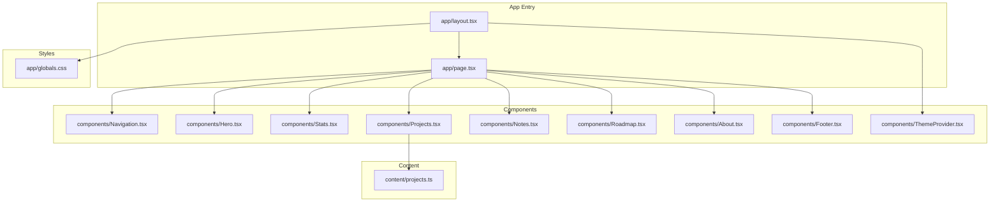

# Getting Started

<cite>
**Referenced Files in This Document**
- [README.md](file://README.md)
- [package.json](file://package.json)
- [next.config.ts](file://next.config.ts)
- [app/layout.tsx](file://app/layout.tsx)
- [app/page.tsx](file://app/page.tsx)
- [components/ThemeProvider.tsx](file://components/ThemeProvider.tsx)
- [app/globals.css](file://app/globals.css)
- [tsconfig.json](file://tsconfig.json)
- [eslint.config.mjs](file://eslint.config.mjs)
- [content/projects.ts](file://content/projects.ts)
</cite>

## Table of Contents
1. [Introduction](#introduction)
2. [Prerequisites](#prerequisites)
3. [Installation](#installation)
4. [Local Development Workflow](#local-development-workflow)
5. [Project Structure Navigation](#project-structure-navigation)
6. [Make Your First Edit](#make-your-first-edit)
7. [Troubleshooting](#troubleshooting)
8. [Browser Compatibility](#browser-compatibility)
9. [Next Steps](#next-steps)

## Introduction
This guide helps you set up and run the Han Neng portfolio website locally. It covers prerequisites, installation, development workflow, file structure navigation, making your first edit with hot reload, troubleshooting common issues, and browser compatibility requirements. The project is a Next.js application using React and TypeScript, styled with Tailwind CSS, and configured for static export.

## Prerequisites
Before starting, ensure you have the following installed:

- Node.js (LTS recommended)
- A package manager: npm (bundled with Node.js), yarn, pnpm, or bun
- Basic familiarity with:
  - React fundamentals (components, props, hooks)
  - TypeScript basics (types, interfaces, modules)
  - Command-line usage (npx, running scripts)

Why these are needed:
- Node.js provides the runtime to execute JavaScript and run the dev server.
- The package manager installs dependencies defined in the project configuration.
- React and TypeScript knowledge helps you navigate and modify components confidently.

**Section sources**
- [package.json:1-29](file://package.json#L1-L29)
- [tsconfig.json:1-35](file://tsconfig.json#L1-L35)

## Installation
Follow these steps to install and start the project:

1. Clone the repository to your local machine.
2. Open a terminal in the project root directory.
3. Install dependencies:
   - Using npm:
     - Run: npm install
   - Using other supported package managers:
     - yarn install
     - pnpm install
     - bun install
4. Start the development server:
   - Using npm:
     - Run: npm run dev
   - Using other supported package managers:
     - yarn dev
     - pnpm dev
     - bun dev
5. Open http://localhost:3000 in your browser to view the site.

Notes:
- The project defines scripts for dev, build, start, and lint in the package configuration.
- The README also documents running the dev server directly via package manager commands.

**Section sources**
- [README.md:1-37](file://README.md#L1-L37)
- [package.json:1-29](file://package.json#L1-L29)

## Local Development Workflow
After starting the development server:

- Hot reload: Save changes in any file; the browser updates automatically without a full refresh.
- Editing pages: Modify app/page.tsx to change the home page content.
- Adding sections: Import and compose new components within the main layout or page.
- Styling: Use Tailwind utility classes and custom theme variables defined in global styles.
- Theme switching: The app includes a client-side theme provider that toggles dark/light mode and persists the choice in localStorage.

Tips:
- Keep component files small and focused.
- Store reusable data (like projects) under content/ and import them where needed.
- Use ESLint to catch issues early during development.

**Section sources**
- [app/page.tsx:1-26](file://app/page.tsx#L1-L26)
- [components/ThemeProvider.tsx:1-56](file://components/ThemeProvider.tsx#L1-L56)
- [app/globals.css:1-108](file://app/globals.css#L1-L108)
- [content/projects.ts:1-56](file://content/projects.ts#L1-L56)
- [eslint.config.mjs:1-19](file://eslint.config.mjs#L1-L19)

## Project Structure Navigation
Key directories and files:

- app/: Next.js App Router entry points and layouts
  - layout.tsx: Root layout, metadata, fonts, and theme provider wrapper
  - page.tsx: Home page composition of sections
  - globals.css: Global styles, Tailwind imports, theme variables, animations
- components/: Reusable UI components (Navigation, Hero, Stats, Projects, Notes, Roadmap, About, Footer, ThemeProvider)
- content/: Static data and configurations (projects, notes, roadmap)
- public/: Static assets served at the site root (robots.txt, sitemap.xml)
- Configuration files:
  - next.config.ts: Next.js configuration (static export enabled)
  - tsconfig.json: TypeScript settings and path aliases (@/*)
  - eslint.config.mjs: Linting rules and ignores
  - package.json: Scripts, dependencies, and devDependencies

How it fits together:
- The root layout sets up metadata, fonts, and wraps children with the theme provider.
- The home page composes multiple section components.
- Content files provide structured data consumed by components.
- Global styles define theme tokens and Tailwind integration.

**Diagram sources**
- [app/layout.tsx:1-103](file://app/layout.tsx#L1-L103)
- [app/page.tsx:1-26](file://app/page.tsx#L1-L26)
- [components/ThemeProvider.tsx:1-56](file://components/ThemeProvider.tsx#L1-L56)
- [app/globals.css:1-108](file://app/globals.css#L1-L108)
- [content/projects.ts:1-56](file://content/projects.ts#L1-L56)

**Section sources**
- [app/layout.tsx:1-103](file://app/layout.tsx#L1-L103)
- [app/page.tsx:1-26](file://app/page.tsx#L1-L26)
- [components/ThemeProvider.tsx:1-56](file://components/ThemeProvider.tsx#L1-L56)
- [app/globals.css:1-108](file://app/globals.css#L1-L108)
- [content/projects.ts:1-56](file://content/projects.ts#L1-L56)

## Make Your First Edit
To quickly see changes:

1. Open app/page.tsx in your editor.
2. Add or reorder a section component (for example, insert a new component between existing ones).
3. Save the file.
4. Watch the browser update automatically thanks to hot reload.

If you want to customize the hero section:
- Edit components/Hero.tsx to adjust text, links, or styling.
- Save and observe the live update.

For theme customization:
- Adjust color tokens and font variables in app/globals.css.
- Toggle dark/light mode using the theme provider logic in components/ThemeProvider.tsx.

For content updates:
- Edit content/projects.ts to add or modify project entries.
- Refresh the page to see updated listings.

**Section sources**
- [app/page.tsx:1-26](file://app/page.tsx#L1-L26)
- [components/Hero.tsx:1-63](file://components/Hero.tsx#L1-L63)
- [app/globals.css:1-108](file://app/globals.css#L1-L108)
- [components/ThemeProvider.tsx:1-56](file://components/ThemeProvider.tsx#L1-L56)
- [content/projects.ts:1-56](file://content/projects.ts#L1-L56)

## Troubleshooting
Common setup issues and resolutions:

- Port 3000 already in use:
  - Stop the process occupying port 3000 or start the dev server on another port if supported by your environment.
- Dependencies not installed:
  - Ensure you ran the install command for your chosen package manager before starting the dev server.
- TypeScript errors:
  - Review compiler options in tsconfig.json and fix type mismatches reported by your editor.
- Linting warnings:
  - Use the lint script to identify issues and follow the configured rules.
- Build output differences:
  - The project is configured for static export; some features requiring a server may behave differently in production builds.

Additional checks:
- Confirm Node.js version meets the requirements of the Next.js and React versions used.
- If using a different package manager, ensure its lockfile matches the project’s expectations.

**Section sources**
- [package.json:1-29](file://package.json#L1-L29)
- [tsconfig.json:1-35](file://tsconfig.json#L1-L35)
- [eslint.config.mjs:1-19](file://eslint.config.mjs#L1-L19)
- [next.config.ts:1-8](file://next.config.ts#L1-L8)

## Browser Compatibility
The project uses modern web standards and Tailwind CSS v4. For best results:

- Use recent versions of Chrome, Edge, Firefox, or Safari.
- Ensure JavaScript and CSS are enabled.
- If experiencing visual inconsistencies, clear cache or try an incognito window.

Note:
- The app applies a “dark” class for dark mode and uses CSS custom properties for theming.
- Animations rely on standard CSS keyframes and transitions supported by modern browsers.

[No sources needed since this section provides general guidance]

## Next Steps
- Explore the components and content files to understand how the site is composed.
- Customize colors and typography in the global styles.
- Add new sections by creating components and integrating them into the home page.
- Configure SEO metadata and social sharing in the root layout.

**Section sources**
- [app/layout.tsx:1-103](file://app/layout.tsx#L1-L103)
- [app/page.tsx:1-26](file://app/page.tsx#L1-L26)
- [app/globals.css:1-108](file://app/globals.css#L1-L108)