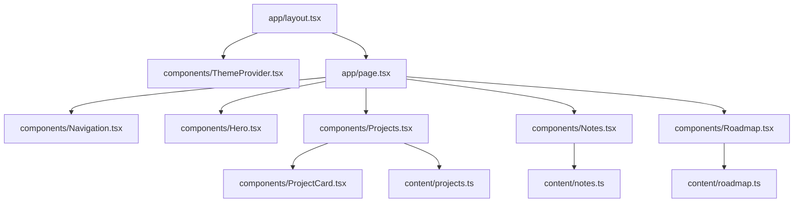
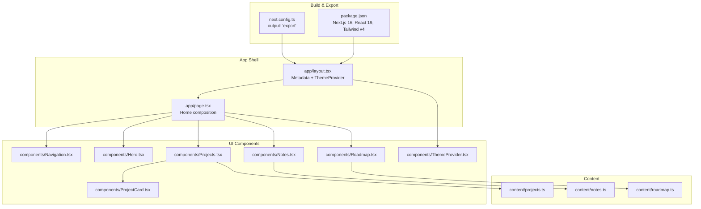
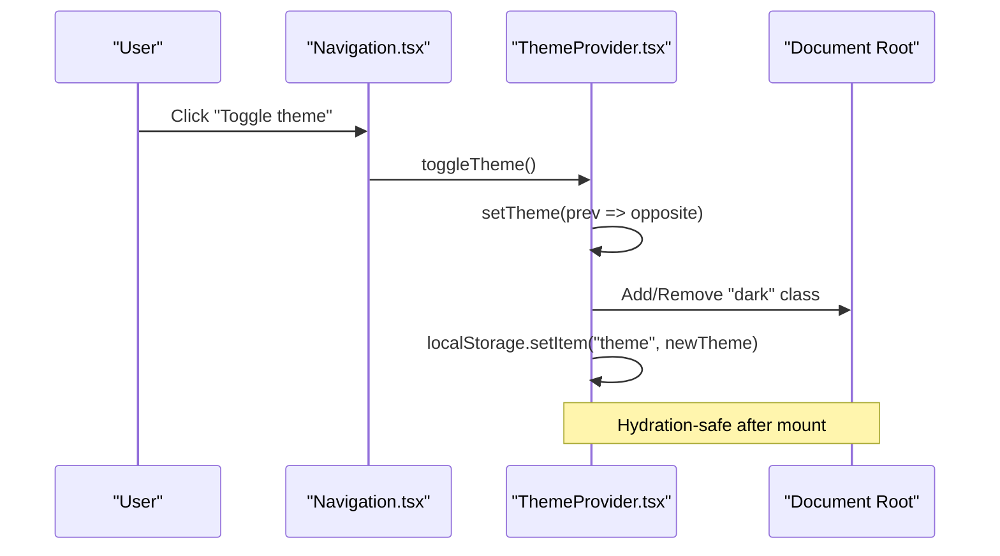
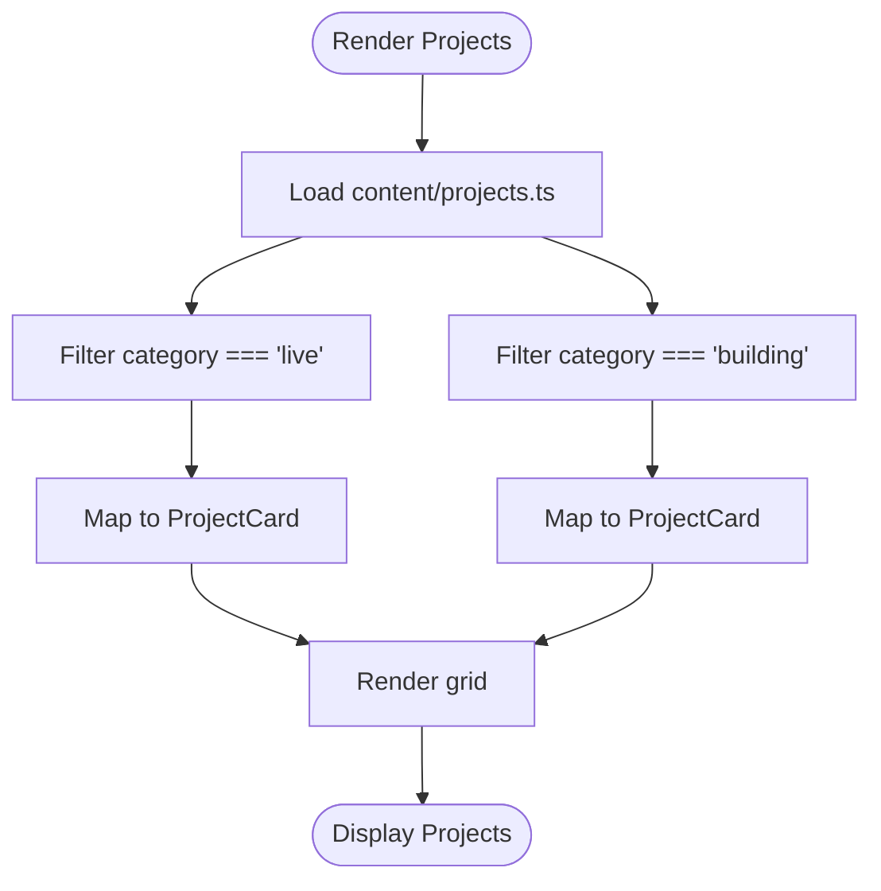
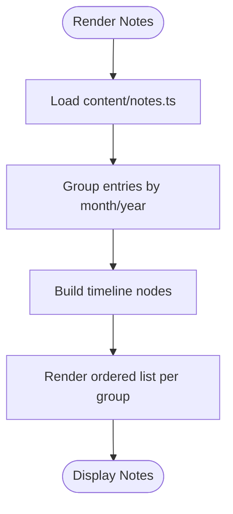
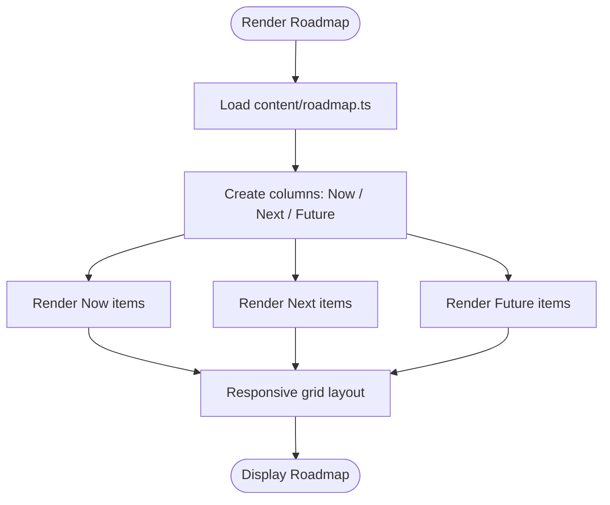
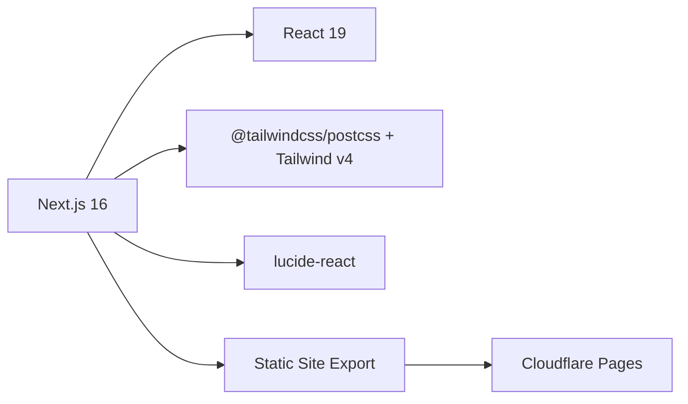

# Project Overview

<cite>
**Referenced Files in This Document**
- [README.md](file://README.md)
- [package.json](file://package.json)
- [next.config.ts](file://next.config.ts)
- [app/layout.tsx](file://app/layout.tsx)
- [app/page.tsx](file://app/page.tsx)
- [components/ThemeProvider.tsx](file://components/ThemeProvider.tsx)
- [components/Navigation.tsx](file://components/Navigation.tsx)
- [components/Hero.tsx](file://components/Hero.tsx)
- [components/Projects.tsx](file://components/Projects.tsx)
- [components/ProjectCard.tsx](file://components/ProjectCard.tsx)
- [components/Notes.tsx](file://components/Notes.tsx)
- [components/Roadmap.tsx](file://components/Roadmap.tsx)
- [content/projects.ts](file://content/projects.ts)
- [content/notes.ts](file://content/notes.ts)
- [content/roadmap.ts](file://content/roadmap.ts)
</cite>

## Table of Contents
1. Introduction
2. Project Structure
3. Core Components
4. Architecture Overview
5. Detailed Component Analysis
6. Dependency Analysis
7. Performance Considerations
8. Troubleshooting Guide
9. Conclusion

## Introduction
Han Neng is a modern, responsive portfolio and studio showcase website built with Next.js 16. It presents an indie software studio’s identity, highlights live and in-progress projects, shares development notes on a timeline, visualizes a product roadmap, and offers theme switching between light and dark modes. The site follows a content-driven architecture where all visible content is defined in TypeScript modules under the content directory and composed into React components. It uses a static site export to produce a fully static build suitable for deployment on platforms like Cloudflare Pages.

Target audience:
- Indie software developers seeking inspiration and a reference implementation for a personal or studio portfolio site
- Technical visitors evaluating a clean, component-based architecture with Tailwind CSS v4 styling and modern React patterns

Key features:
- Interactive project displays grouped by status (Live and Building)
- Development notes timeline showing recent updates
- Roadmap visualization organized into Now, Next, and Future
- Theme switching with persistent user preference
- Responsive navigation with mobile menu support
- SEO metadata and structured data for search engines

Technology stack:
- Next.js 16 with static site export
- React 19 and React DOM 19
- TypeScript 5
- Tailwind CSS v4 via @tailwindcss/postcss
- Lucide icons for UI elements
- Wrangler for Cloudflare integration
- Deployment target: Cloudflare Pages (static export)

Conceptual overview for beginners:
- The homepage is a single-page experience with sections that scroll into view
- Projects are filtered and displayed as cards with tags and links
- Notes appear as a chronological list grouped by month and year
- Roadmap shows current priorities, upcoming items, and long-term goals
- Users can toggle between light and dark themes; their choice persists across sessions

Technical overview for experienced developers:
- Static site export configured in Next.js config
- Content-driven architecture using typed data files
- Component composition pattern with clear separation of concerns
- Client-side theme context with hydration-safe initialization
- Minimal client-only code for interactivity (navigation, theme toggle)

[No sources needed since this section provides general guidance]

## Project Structure
The repository follows a feature-oriented layout:
- app/: Next.js App Router root layout and page entry
- components/: Reusable UI components for navigation, hero, projects, notes, roadmap, theme provider, and footer
- content/: Typed data modules defining projects, notes, and roadmap
- public/: Static assets such as robots.txt and sitemap.xml
- Configuration files for Next.js, Tailwind, ESLint, and TypeScript



**Diagram sources**
- [app/layout.tsx:1-103](file://app/layout.tsx#L1-L103)
- [app/page.tsx:1-26](file://app/page.tsx#L1-L26)
- [components/ThemeProvider.tsx:1-56](file://components/ThemeProvider.tsx#L1-L56)
- [components/Navigation.tsx:1-88](file://components/Navigation.tsx#L1-L88)
- [components/Hero.tsx:1-63](file://components/Hero.tsx#L1-L63)
- [components/Projects.tsx:1-47](file://components/Projects.tsx#L1-L47)
- [components/ProjectCard.tsx:1-72](file://components/ProjectCard.tsx#L1-L72)
- [components/Notes.tsx:1-39](file://components/Notes.tsx#L1-L39)
- [components/Roadmap.tsx:1-81](file://components/Roadmap.tsx#L1-L81)
- [content/projects.ts:1-56](file://content/projects.ts#L1-L56)
- [content/notes.ts:1-19](file://content/notes.ts#L1-L19)
- [content/roadmap.ts:1-33](file://content/roadmap.ts#L1-L33)

**Section sources**
- [app/layout.tsx:1-103](file://app/layout.tsx#L1-L103)
- [app/page.tsx:1-26](file://app/page.tsx#L1-L26)
- [components/ThemeProvider.tsx:1-56](file://components/ThemeProvider.tsx#L1-L56)
- [components/Navigation.tsx:1-88](file://components/Navigation.tsx#L1-L88)
- [components/Hero.tsx:1-63](file://components/Hero.tsx#L1-L63)
- [components/Projects.tsx:1-47](file://components/Projects.tsx#L1-L47)
- [components/ProjectCard.tsx:1-72](file://components/ProjectCard.tsx#L1-L72)
- [components/Notes.tsx:1-39](file://components/Notes.tsx#L1-L39)
- [components/Roadmap.tsx:1-81](file://components/Roadmap.tsx#L1-L81)
- [content/projects.ts:1-56](file://content/projects.ts#L1-L56)
- [content/notes.ts:1-19](file://content/notes.ts#L1-L19)
- [content/roadmap.ts:1-33](file://content/roadmap.ts#L1-L33)

## Core Components
This section summarizes the responsibilities of each core component and how they compose the site.

- Root layout and metadata
  - Provides global fonts, metadata, Open Graph and Twitter card configuration, canonical URL, robots directives, and JSON-LD structured data
  - Wraps application children with the theme provider to enable theme switching across the app

- Theme provider
  - Manages theme state ("dark" | "light") and persistence via localStorage
  - Applies the "dark" class to the document root and avoids hydration mismatches by deferring UI until mounted

- Navigation
  - Fixed top bar with smooth-scroll anchors to main sections
  - Mobile-responsive menu with hamburger toggle
  - Integrated theme toggle button accessible from both desktop and mobile views

- Hero
  - Primary landing section introducing the studio and its mission
  - Calls-to-action to explore projects and learn about the author

- Projects
  - Reads project data from content and renders two groups: Live and Building
  - Uses a grid layout for responsive presentation

- ProjectCard
  - Displays project icon, title, description, tags, and action buttons (Visit Project and GitHub)
  - Status badge color-coded by project status

- Notes
  - Renders a vertical timeline grouped by month and year
  - Each note entry appears as a bullet point along a left border line

- Roadmap
  - Three-column layout for Now, Next, and Future
  - Visual emphasis on “Now” with an animated indicator

**Section sources**
- [app/layout.tsx:16-50](file://app/layout.tsx#L16-L50)
- [app/layout.tsx:52-103](file://app/layout.tsx#L52-L103)
- [components/ThemeProvider.tsx:15-51](file://components/ThemeProvider.tsx#L15-L51)
- [components/Navigation.tsx:15-87](file://components/Navigation.tsx#L15-L87)
- [components/Hero.tsx:3-62](file://components/Hero.tsx#L3-L62)
- [components/Projects.tsx:4-46](file://components/Projects.tsx#L4-L46)
- [components/ProjectCard.tsx:15-71](file://components/ProjectCard.tsx#L15-L71)
- [components/Notes.tsx:3-38](file://components/Notes.tsx#L3-L38)
- [components/Roadmap.tsx:3-80](file://components/Roadmap.tsx#L3-L80)

## Architecture Overview
The site is a statically exported Next.js application with a content-driven architecture. Data lives in TypeScript modules and is consumed by presentational components. Interactivity is limited to client-only components for navigation and theme toggling.



**Diagram sources**
- [next.config.ts:3-5](file://next.config.ts#L3-L5)
- [package.json:11-27](file://package.json#L11-L27)
- [app/layout.tsx:1-103](file://app/layout.tsx#L1-L103)
- [app/page.tsx:1-26](file://app/page.tsx#L1-L26)
- [components/Navigation.tsx:1-88](file://components/Navigation.tsx#L1-L88)
- [components/Hero.tsx:1-63](file://components/Hero.tsx#L1-L63)
- [components/Projects.tsx:1-47](file://components/Projects.tsx#L1-L47)
- [components/ProjectCard.tsx:1-72](file://components/ProjectCard.tsx#L1-L72)
- [components/Notes.tsx:1-39](file://components/Notes.tsx#L1-L39)
- [components/Roadmap.tsx:1-81](file://components/Roadmap.tsx#L1-L81)
- [components/ThemeProvider.tsx:1-56](file://components/ThemeProvider.tsx#L1-L56)
- [content/projects.ts:1-56](file://content/projects.ts#L1-L56)
- [content/notes.ts:1-19](file://content/notes.ts#L1-L19)
- [content/roadmap.ts:1-33](file://content/roadmap.ts#L1-L33)

## Detailed Component Analysis

### Theme Provider and Theme Switching Flow
Theme management is implemented as a client component that initializes theme from localStorage, applies the "dark" class to the document root, and exposes a toggle function through context.



**Diagram sources**
- [components/Navigation.tsx:41-58](file://components/Navigation.tsx#L41-L58)
- [components/ThemeProvider.tsx:15-51](file://components/ThemeProvider.tsx#L15-L51)

**Section sources**
- [components/ThemeProvider.tsx:1-56](file://components/ThemeProvider.tsx#L1-L56)
- [components/Navigation.tsx:1-88](file://components/Navigation.tsx#L1-L88)

### Projects Section Data Flow
Projects are sourced from a typed data module and rendered in two categories. The rendering logic filters by category and maps entries to interactive cards.



**Diagram sources**
- [components/Projects.tsx:4-46](file://components/Projects.tsx#L4-L46)
- [content/projects.ts:14-55](file://content/projects.ts#L14-L55)
- [components/ProjectCard.tsx:15-71](file://components/ProjectCard.tsx#L15-L71)

**Section sources**
- [components/Projects.tsx:1-47](file://components/Projects.tsx#L1-L47)
- [content/projects.ts:1-56](file://content/projects.ts#L1-L56)
- [components/ProjectCard.tsx:1-72](file://components/ProjectCard.tsx#L1-L72)

### Notes Timeline Rendering
Notes are grouped by month and year and rendered as a vertical timeline with consistent spacing and markers.



**Diagram sources**
- [components/Notes.tsx:3-38](file://components/Notes.tsx#L3-L38)
- [content/notes.ts:7-18](file://content/notes.ts#L7-L18)

**Section sources**
- [components/Notes.tsx:1-39](file://components/Notes.tsx#L1-L39)
- [content/notes.ts:1-19](file://content/notes.ts#L1-L19)

### Roadmap Visualization
Roadmap data is split into three phases and presented in a responsive grid. The “Now” phase includes an animated indicator to emphasize current work.



**Diagram sources**
- [components/Roadmap.tsx:3-80](file://components/Roadmap.tsx#L3-L80)
- [content/roadmap.ts:6-32](file://content/roadmap.ts#L6-L32)

**Section sources**
- [components/Roadmap.tsx:1-81](file://components/Roadmap.tsx#L1-L81)
- [content/roadmap.ts:1-33](file://content/roadmap.ts#L1-L33)

### Class Relationships Among Key Components
```mermaid
classDiagram
class ThemeProvider {
+state theme
+function toggleTheme()
+effect applyClassToRoot()
+effect persistToLocalStorage()
}
class Navigation {
+state isOpen
+function toggleMenu()
+function toggleTheme()
}
class Projects {
+function filterProjects()
+function renderCards()
}
class ProjectCard {
+prop project
+render statusBadge()
+render actions()
}
class Notes {
+function renderTimeline()
}
class Roadmap {
+function renderColumns()
}
Navigation --> ThemeProvider : "uses context"
Projects --> ProjectCard : "composes"
Projects --> "content/projects.ts" : "reads data"
Notes --> "content/notes.ts" : "reads data"
Roadmap --> "content/roadmap.ts" : "reads data"
```

**Diagram sources**
- [components/ThemeProvider.tsx:1-56](file://components/ThemeProvider.tsx#L1-L56)
- [components/Navigation.tsx:1-88](file://components/Navigation.tsx#L1-L88)
- [components/Projects.tsx:1-47](file://components/Projects.tsx#L1-L47)
- [components/ProjectCard.tsx:1-72](file://components/ProjectCard.tsx#L1-L72)
- [components/Notes.tsx:1-39](file://components/Notes.tsx#L1-L39)
- [components/Roadmap.tsx:1-81](file://components/Roadmap.tsx#L1-L81)
- [content/projects.ts:1-56](file://content/projects.ts#L1-L56)
- [content/notes.ts:1-19](file://content/notes.ts#L1-L19)
- [content/roadmap.ts:1-33](file://content/roadmap.ts#L1-L33)

**Section sources**
- [components/ThemeProvider.tsx:1-56](file://components/ThemeProvider.tsx#L1-L56)
- [components/Navigation.tsx:1-88](file://components/Navigation.tsx#L1-L88)
- [components/Projects.tsx:1-47](file://components/Projects.tsx#L1-L47)
- [components/ProjectCard.tsx:1-72](file://components/ProjectCard.tsx#L1-L72)
- [components/Notes.tsx:1-39](file://components/Notes.tsx#L1-L39)
- [components/Roadmap.tsx:1-81](file://components/Roadmap.tsx#L1-L81)
- [content/projects.ts:1-56](file://content/projects.ts#L1-L56)
- [content/notes.ts:1-19](file://content/notes.ts#L1-L19)
- [content/roadmap.ts:1-33](file://content/roadmap.ts#L1-L33)

## Dependency Analysis
High-level dependencies include Next.js runtime, React 19, Tailwind CSS v4, and Lucide icons. The build produces a static export suitable for Cloudflare Pages.



**Diagram sources**
- [package.json:11-27](file://package.json#L11-L27)
- [next.config.ts:3-5](file://next.config.ts#L3-L5)

**Section sources**
- [package.json:1-29](file://package.json#L1-L29)
- [next.config.ts:1-8](file://next.config.ts#L1-L8)

## Performance Considerations
- Static site export ensures fast load times and minimal server overhead
- Client-only components are scoped to interactivity (navigation and theme), keeping the rest of the app lightweight
- Content-driven architecture avoids runtime data fetching, improving performance and reliability
- Tailwind CSS v4 enables efficient utility-first styling with minimal custom CSS
- Fonts are optimized via next/font to reduce layout shifts and improve perceived performance

[No sources needed since this section provides general guidance]

## Troubleshooting Guide
Common issues and resolutions:
- Hydration mismatch when toggling theme
  - Ensure the theme provider waits until mounted before applying classes and reading/writing localStorage
  - Verify that the root HTML element receives the correct initial class to avoid flash of unstyled content
- Theme not persisting across sessions
  - Confirm localStorage writes occur after mount and that the key used matches reads
- Navigation links not scrolling smoothly
  - Check anchor IDs match section IDs and ensure no fixed header offsets interfere with scroll position
- Projects not displaying
  - Validate that content/projects.ts exports a valid array and that category values match expected strings
- Notes or Roadmap sections empty
  - Ensure content/notes.ts and content/roadmap.ts export correctly shaped data structures

**Section sources**
- [components/ThemeProvider.tsx:19-36](file://components/ThemeProvider.tsx#L19-L36)
- [components/Navigation.tsx:69-83](file://components/Navigation.tsx#L69-L83)
- [components/Projects.tsx:5-7](file://components/Projects.tsx#L5-L7)
- [content/projects.ts:14-55](file://content/projects.ts#L14-L55)
- [content/notes.ts:7-18](file://content/notes.ts#L7-L18)
- [content/roadmap.ts:6-32](file://content/roadmap.ts#L6-L32)

## Conclusion
Han Neng demonstrates a clean, content-driven portfolio site built with modern web technologies. Its static site export, component composition, and thoughtful UX features make it an excellent reference for indie developers. The architecture balances simplicity and extensibility, enabling easy updates to content while maintaining strong performance and accessibility.

[No sources needed since this section summarizes without analyzing specific files]