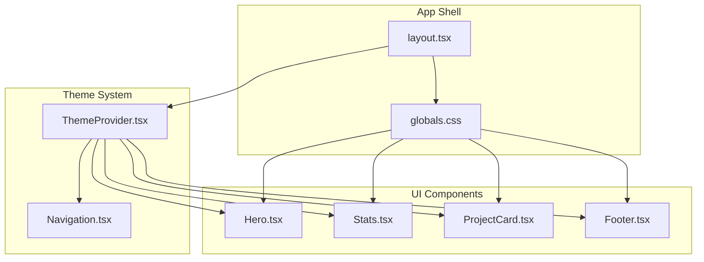
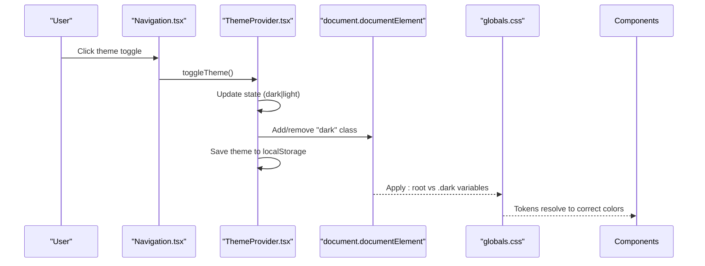
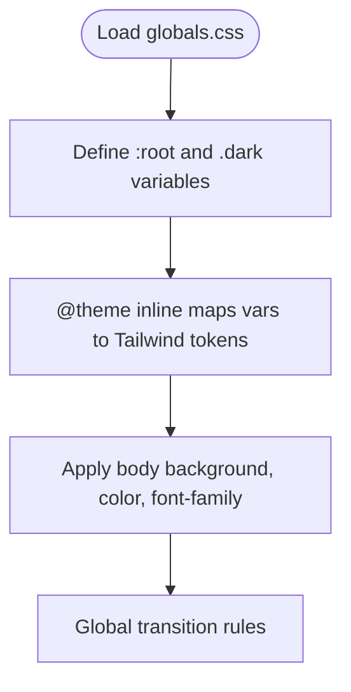
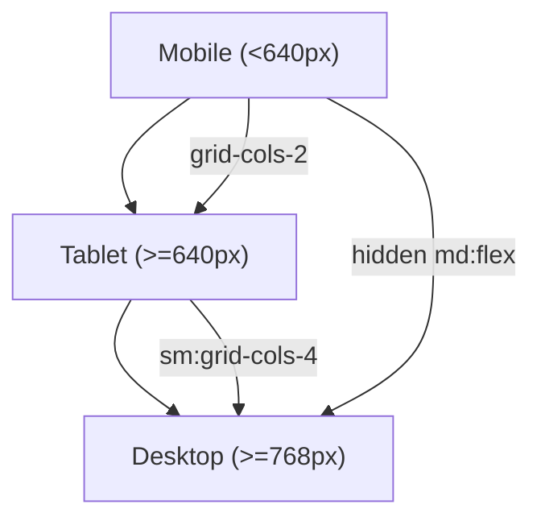
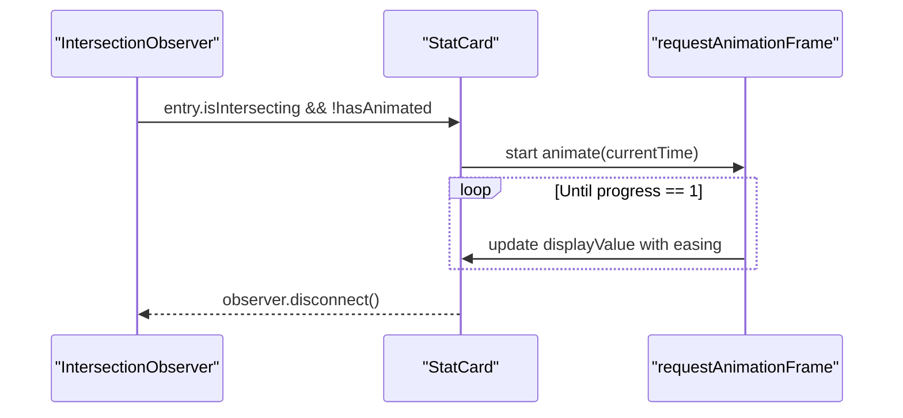
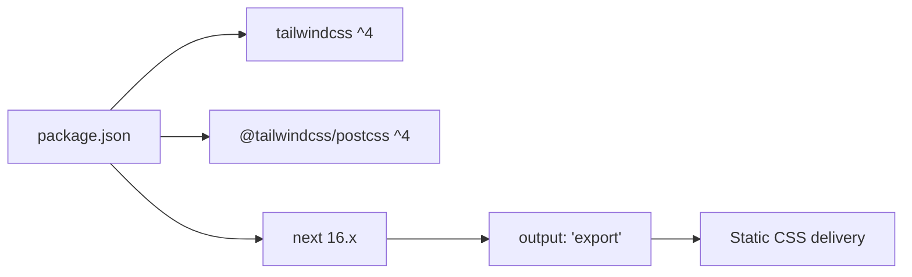

# Styling and Theming

<cite>
**Referenced Files in This Document**
- [globals.css](file://app/globals.css)
- [layout.tsx](file://app/layout.tsx)
- [ThemeProvider.tsx](file://components/ThemeProvider.tsx)
- [Navigation.tsx](file://components/Navigation.tsx)
- [Hero.tsx](file://components/Hero.tsx)
- [Stats.tsx](file://components/Stats.tsx)
- [ProjectCard.tsx](file://components/ProjectCard.tsx)
- [Footer.tsx](file://components/Footer.tsx)
- [postcss.config.mjs](file://postcss.config.mjs)
- [package.json](file://package.json)
</cite>

## Table of Contents
1. [Introduction](#introduction)
2. [Project Structure](#project-structure)
3. [Core Components](#core-components)
4. [Architecture Overview](#architecture-overview)
5. [Detailed Component Analysis](#detailed-component-analysis)
6. [Dependency Analysis](#dependency-analysis)
7. [Performance Considerations](#performance-considerations)
8. [Troubleshooting Guide](#troubleshooting-guide)
9. [Conclusion](#conclusion)
10. [Appendices](#appendices)

## Introduction
This document explains the styling and theming system for the Han Neng portfolio website. It covers:
- Tailwind CSS v4 with a utility-first approach and custom theme configuration
- Dark/light theme implementation using React Context API and localStorage persistence
- Global CSS variables, color schemes, and typography settings
- Responsive design patterns using a mobile-first approach with Tailwind breakpoints
- Animation implementations including animated statistics counters and smooth transitions
- Guidelines for adding custom styles while maintaining consistency
- Cross-browser compatibility considerations and performance optimization techniques for CSS delivery
- Examples for creating new theme variants and customizing existing components

## Project Structure
The styling and theming are implemented across a small set of focused files:
- Global styles and theme variables live in the application’s global stylesheet
- The root layout wires up fonts and applies the dark class to the HTML element
- A client-side ThemeProvider manages theme state and persistence
- UI components use Tailwind utilities and semantic tokens (CSS variables) for colors and spacing
- PostCSS is configured to process Tailwind v4 via its official plugin



**Diagram sources**
- [layout.tsx:1-103](file://app/layout.tsx#L1-L103)
- [globals.css:1-108](file://app/globals.css#L1-L108)
- [ThemeProvider.tsx:1-56](file://components/ThemeProvider.tsx#L1-L56)
- [Navigation.tsx:1-88](file://components/Navigation.tsx#L1-L88)
- [Hero.tsx:1-63](file://components/Hero.tsx#L1-L63)
- [Stats.tsx:1-85](file://components/Stats.tsx#L1-L85)
- [ProjectCard.tsx:1-72](file://components/ProjectCard.tsx#L1-L72)
- [Footer.tsx:1-21](file://components/Footer.tsx#L1-L21)

**Section sources**
- [layout.tsx:1-103](file://app/layout.tsx#L1-L103)
- [globals.css:1-108](file://app/globals.css#L1-L108)
- [ThemeProvider.tsx:1-56](file://components/ThemeProvider.tsx#L1-L56)

## Core Components
- ThemeProvider: Manages theme state (“dark” | “light”), persists selection to localStorage, and toggles the “dark” class on the document root. Exposes a hook for consuming theme context.
- Navigation: Uses the theme hook to render appropriate icons and toggle theme on click.
- Hero, Stats, ProjectCard, Footer: Use Tailwind utilities and semantic tokens for consistent appearance across themes.

Key responsibilities:
- ThemeProvider centralizes theme logic and ensures SSR-safe hydration by deferring DOM updates until after mount.
- Components remain theme-agnostic; they rely on CSS variables and Tailwind tokens rather than hard-coded colors.

**Section sources**
- [ThemeProvider.tsx:1-56](file://components/ThemeProvider.tsx#L1-L56)
- [Navigation.tsx:1-88](file://components/Navigation.tsx#L1-L88)
- [Hero.tsx:1-63](file://components/Hero.tsx#L1-L63)
- [Stats.tsx:1-85](file://components/Stats.tsx#L1-L85)
- [ProjectCard.tsx:1-72](file://components/ProjectCard.tsx#L1-L72)
- [Footer.tsx:1-21](file://components/Footer.tsx#L1-L21)

## Architecture Overview
The theming architecture combines CSS custom properties, Tailwind v4’s @theme mapping, and a React Context provider:
- CSS variables define light/dark palettes and are mapped into Tailwind tokens via @theme inline
- The root layout sets font variable classes on the <html> element
- ThemeProvider toggles the .dark class on the document root and persists the choice
- Components consume theme via the provided hook or rely on CSS variables directly



**Diagram sources**
- [Navigation.tsx:1-88](file://components/Navigation.tsx#L1-L88)
- [ThemeProvider.tsx:1-56](file://components/ThemeProvider.tsx#L1-L56)
- [globals.css:1-108](file://app/globals.css#L1-L108)

## Detailed Component Analysis

### Theme Provider and Context
- State management: Holds current theme and a mounted flag to avoid hydration mismatches.
- Persistence: Reads from localStorage on first load and writes on every change.
- DOM integration: Adds/removes the “dark” class on the document root to switch CSS variable values.
- API: Provides a hook for components to read the current theme and trigger toggles.

```mermaid
classDiagram
class ThemeProvider {
+state theme
+state mounted
+effect initFromLocalStorage()
+effect applyToDOM()
+toggleTheme() void
+render(children)
}
class useTheme {
+return { theme, toggleTheme }
}
ThemeProvider --> useTheme : "exports"
```

**Diagram sources**
- [ThemeProvider.tsx:1-56](file://components/ThemeProvider.tsx#L1-L56)

**Section sources**
- [ThemeProvider.tsx:1-56](file://components/ThemeProvider.tsx#L1-L56)

### Global Styles and Theme Variables
- Custom variant: Defines a dark variant selector for Tailwind v4.
- CSS variables:
  - Light mode: background, foreground, card, borders, secondary text, accent, accent hover, nav background
  - Dark mode: overrides for all above
- Tailwind token mapping: Maps CSS variables to Tailwind tokens under @theme inline so utilities like bg-background, text-foreground, border-card-border work consistently.
- Typography: Uses Geist Sans and Mono via Next.js font loader; variables are applied through the html className.
- Transitions: Smooth transitions for background, color, and border-color across the entire app.



**Diagram sources**
- [globals.css:1-108](file://app/globals.css#L1-L108)
- [layout.tsx:1-103](file://app/layout.tsx#L1-L103)

**Section sources**
- [globals.css:1-108](file://app/globals.css#L1-L108)
- [layout.tsx:1-103](file://app/layout.tsx#L1-L103)

### Responsive Design Patterns (Mobile-First)
- Mobile-first utilities: Components use base classes for small screens and add sm: and md: prefixes for larger viewports.
- Breakpoints used:
  - sm: for tablet-like adjustments (e.g., hero text sizing, grid columns)
  - md: for desktop layouts (e.g., navigation visibility, grid changes)
- Example patterns:
  - Grids: Two-column on small screens, four-column on medium and above
  - Navigation: Hidden links on mobile, visible on md+
  - Hero: Stacked actions on mobile, row on md+



[No sources needed since this diagram shows conceptual workflow, not actual code structure]

**Section sources**
- [Hero.tsx:1-63](file://components/Hero.tsx#L1-L63)
- [Stats.tsx:1-85](file://components/Stats.tsx#L1-L85)
- [Navigation.tsx:1-88](file://components/Navigation.tsx#L1-L88)

### Animations and Interactions
- Fade-in animations: Keyframes and utility classes provide entrance effects for hero content.
- Count-up animation: IntersectionObserver triggers an eased counter animation when stats enter the viewport.
- Hover transitions: Cards and buttons use transition utilities for smooth color and shadow changes.



**Diagram sources**
- [Stats.tsx:1-85](file://components/Stats.tsx#L1-L85)
- [globals.css:1-108](file://app/globals.css#L1-L108)

**Section sources**
- [Stats.tsx:1-85](file://components/Stats.tsx#L1-L85)
- [globals.css:1-108](file://app/globals.css#L1-L108)

### Color Schemes and Semantic Tokens
- Accent palette: Primary accent and hover states are defined as variables and exposed via Tailwind tokens.
- Surface and borders: Card backgrounds and borders adapt per theme.
- Text hierarchy: Foreground and secondary-text ensure readability across themes.
- Usage examples:
  - Backgrounds: bg-background, bg-card
  - Borders: border-card-border
  - Text: text-foreground, text-secondary-text, text-accent
  - Interactive: hover:bg-accent-hover, hover:border-accent/30

**Section sources**
- [globals.css:1-108](file://app/globals.css#L1-L108)
- [ProjectCard.tsx:1-72](file://components/ProjectCard.tsx#L1-L72)
- [Hero.tsx:1-63](file://components/Hero.tsx#L1-L63)
- [Footer.tsx:1-21](file://components/Footer.tsx#L1-L21)

### Typography Settings
- Fonts: Geist Sans and Geist Mono loaded via next/font and injected as CSS variables.
- Application: Font variables are attached to the html element and referenced in Tailwind tokens.
- Fallbacks: System font stacks are included as fallbacks in body styles.

**Section sources**
- [layout.tsx:1-103](file://app/layout.tsx#L1-L103)
- [globals.css:1-108](file://app/globals.css#L1-L108)

## Dependency Analysis
Tailwind v4 is integrated via PostCSS with the official plugin. The project uses Next.js export output, which influences how static assets (including CSS) are served.



**Diagram sources**
- [package.json:1-29](file://package.json#L1-L29)
- [postcss.config.mjs:1-8](file://postcss.config.mjs#L1-L8)
- [next.config.ts:1-8](file://next.config.ts#L1-L8)

**Section sources**
- [package.json:1-29](file://package.json#L1-L29)
- [postcss.config.mjs:1-8](file://postcss.config.mjs#L1-L8)
- [next.config.ts:1-8](file://next.config.ts#L1-L8)

## Performance Considerations
- Utility-first efficiency: Tailwind v4 generates only used utilities, minimizing CSS size.
- CSS variables: Theme switching avoids reflows by toggling a single class and relying on variable resolution.
- Transition costs: Global transitions are lightweight; keep durations short and avoid animating expensive properties.
- Animation strategy: Use requestAnimationFrame and IntersectionObserver to defer heavy work until needed.
- Static export: With Next.js export, CSS is prebuilt and cached, improving load times.

[No sources needed since this section provides general guidance]

## Troubleshooting Guide
- Theme does not persist:
  - Ensure the ThemeProvider wraps the app tree and that localStorage is available in the browser environment.
  - Verify the “dark” class is added/removed on the document root when toggling.
- Colors not updating:
  - Confirm that CSS variables are correctly mapped to Tailwind tokens via @theme inline.
  - Check that components use semantic tokens (e.g., bg-background) instead of hardcoded hex values.
- Hydration mismatch:
  - The provider defers DOM updates until mounted; ensure no server-rendered theme-dependent styles are applied before mount.
- Animations not triggering:
  - For count-up, verify the component is within the viewport and the observer threshold is met.
  - Ensure keyframe classes exist and are not overridden by more specific selectors.

**Section sources**
- [ThemeProvider.tsx:1-56](file://components/ThemeProvider.tsx#L1-L56)
- [globals.css:1-108](file://app/globals.css#L1-L108)
- [Stats.tsx:1-85](file://components/Stats.tsx#L1-L85)

## Conclusion
The site employs a clean, scalable theming system built on Tailwind v4 and CSS variables. The React Context-based ThemeProvider ensures consistent behavior across SSR and client environments, while components remain decoupled from theme specifics. The mobile-first responsive patterns and subtle animations deliver a polished experience with minimal overhead.

[No sources needed since this section summarizes without analyzing specific files]

## Appendices

### Adding Custom Styles While Maintaining Consistency
- Prefer Tailwind utilities for layout, spacing, and typography.
- Introduce new colors via CSS variables and map them into Tailwind tokens under @theme inline.
- Keep transitions and motion consistent with existing timings and easings.
- Avoid overriding global styles unless necessary; prefer scoped component-level classes.

**Section sources**
- [globals.css:1-108](file://app/globals.css#L1-L108)

### Creating New Theme Variants
- Extend the custom variant selector if you need additional pseudo-class-based variants.
- Add new CSS variables under both :root and .dark blocks.
- Map new variables to Tailwind tokens in @theme inline.
- Use the new tokens throughout components (e.g., bg-new-token, text-new-token).

**Section sources**
- [globals.css:1-108](file://app/globals.css#L1-L108)

### Customizing Existing Components
- Adjust spacing and layout using Tailwind utilities (e.g., padding, margins, grids).
- Change colors by referencing semantic tokens rather than hard-coded values.
- Enhance interactions with transition utilities and hover/focus states.

**Section sources**
- [ProjectCard.tsx:1-72](file://components/ProjectCard.tsx#L1-L72)
- [Hero.tsx:1-63](file://components/Hero.tsx#L1-L63)
- [Footer.tsx:1-21](file://components/Footer.tsx#L1-L21)

### Cross-Browser Compatibility Considerations
- CSS variables and modern features are widely supported; test Safari and older browsers if targeting legacy audiences.
- Ensure backdrop-blur and other advanced effects degrade gracefully where unsupported.
- Validate that prefers-color-scheme media queries behave as expected on target platforms.

[No sources needed since this section provides general guidance]